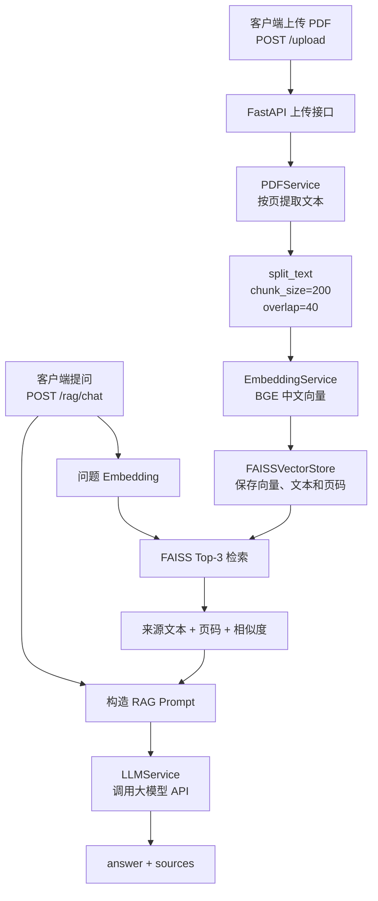

# Mini RAG Backend

一个基于 FastAPI、中文 Embedding、FAISS 和 LLM API 的纯文本科研 PDF RAG 后端。

项目支持上传文本型 PDF，按页提取并切分文本，建立内存向量索引；用户提问后，系统检索 Top-3 文本块，让大模型根据检索资料回答，并返回来源文本、PDF 页码和相似度。

**当前进度：Day 30/30**

**当前状态：30 天 Mini RAG 学习主线已完成，项目已进入演示、复盘与持续优化阶段。**

## 核心功能

- 使用 FastAPI 提供普通聊天、历史记录、PDF 上传和 RAG 问答接口。
- 使用 Pydantic 校验请求与响应数据。
- 使用 `httpx.AsyncClient` 异步调用 LLM API，并处理配置缺失、超时、连接失败、上游状态码和响应格式异常。
- 使用 SQLite 保存普通 `/chat` 的用户消息和模型回复。
- 使用 `pypdf` 按页提取文本型 PDF 的内容。
- 使用带 overlap 的字符切块保留相邻文本上下文。
- 使用 `BAAI/bge-small-zh-v1.5` 生成 512 维归一化中文向量。
- 使用 FAISS `IndexFlatIP` 完成 Top-3 向量检索。
- 让 `/rag/chat` 返回回答以及来源文本、PDF 页码和相似度。
- 使用 12 道固定问题建立基线，并比较 Top-1 与 Top-3 的检索效果。
- 提供 Dockerfile 和容器启动命令。

## RAG 架构与数据流



上传阶段：

```text
PDF
→ 按页提取文字
→ 字符切块
→ 文档 Embedding
→ 写入 FAISS，并保留页码元数据
```

提问阶段：

```text
问题
→ 问题 Embedding
→ FAISS Top-3
→ 参考资料
→ RAG Prompt
→ 大模型
→ 回答与来源
```

普通 `/chat` 与 RAG 问答是两条独立链路：SQLite 目前只保存普通聊天历史，`/rag/chat` 不写入 `messages` 表。

## 技术栈

- **Python 3.11**：项目开发语言与容器运行版本。
- **FastAPI + Uvicorn**：HTTP API、请求处理和 Swagger 接口文档。
- **Pydantic**：请求、响应和消息模型校验。
- **HTTPX**：异步调用大模型 API。
- **DeepSeek API**：普通聊天和基于检索上下文的回答生成。
- **SQLite**：保存普通聊天历史。
- **pypdf**：按页提取文本型 PDF。
- **Sentence Transformers**：加载 `BAAI/bge-small-zh-v1.5` 中文 Embedding 模型。
- **FAISS**：使用归一化向量和 `IndexFlatIP` 完成相似度检索。
- **Docker**：提供可重复构建的 Linux 容器运行环境。

完整 Python 依赖和固定版本见 [requirements.txt](requirements.txt)。

## API 接口

| 方法 | 路径 | 作用 |
| --- | --- | --- |
| GET | `/` | 返回服务运行提示 |
| GET | `/health` | 返回服务状态和 LLM 配置是否齐全 |
| POST | `/chat` | 调用普通 LLM、保存消息并返回回答 |
| GET | `/history` | 按顺序返回 SQLite 中的普通聊天历史 |
| GET | `/request-info` | 读取可选的 `X-Client-Name` 请求头 |
| POST | `/upload` | 上传 PDF，完成解析、Chunk、Embedding 和 FAISS 建库 |
| POST | `/rag/chat` | 针对最近上传的 PDF 检索并回答，返回来源元数据 |

当前只维护最近一次成功上传的 PDF 索引。服务刚启动或重启后，需要先调用 `/upload`，再调用 `/rag/chat`。

## 本地运行

以下命令适用于 Windows PowerShell。

```powershell
git clone https://github.com/lv-xiaoke/260804_mini-rag-backend.git
cd 260804_mini-rag-backend

python -m venv .venv
.\.venv\Scripts\Activate.ps1
python -m pip install -r requirements.txt
```

在项目根目录创建 `.env`，填写自己的模型配置：

```env
LLM_API_KEY=
LLM_BASE_URL=
LLM_MODEL=
```

`.env` 已被 Git 和 Docker 构建上下文忽略，不应提交到仓库。

启动服务：

```powershell
python -m uvicorn app.main:app --reload
```

启动后访问：

- Swagger：<http://127.0.0.1:8000/docs>
- 健康检查：<http://127.0.0.1:8000/health>
- 服务根路径：<http://127.0.0.1:8000/>

应用导入时会加载本地 Embedding 模型。第一次运行可能需要下载模型，因此启动时间会比普通 FastAPI 项目更长。

## Docker 运行

项目根目录已经提供 [Dockerfile](Dockerfile) 和 [.dockerignore](.dockerignore)。Docker Desktop 准备好后，可以执行：

```powershell
docker build -t mini-rag-backend .

docker run `
    --rm `
    -p 127.0.0.1:8000:8000 `
    --env-file .env `
    mini-rag-backend
```

`.env` 通过 `--env-file` 在容器运行时注入，不会被复制进镜像。当前没有配置 volume；使用 `--rm` 删除容器后，容器内的 SQLite 数据、模型缓存和内存 FAISS 索引不会保留。

仓库已提供容器化文件和运行命令，但 README 不将具体机器上的 Docker Desktop 安装状态视为项目功能保证。

## RAG 调用示例

### 1. 上传 PDF

测试 PDF 属于本地输入文件，不提交到仓库。准备一个带文字层的 PDF，并保存为 `data/documents/sample.pdf`，然后执行：

```powershell
curl.exe `
    -X POST `
    -F "file=@data/documents/sample.pdf;type=application/pdf" `
    "http://127.0.0.1:8000/upload"
```

响应结构：

```json
{
  "filename": "sample.pdf",
  "page_count": 3,
  "chunk_count": 10
}
```

`page_count` 和 `chunk_count` 取决于实际 PDF 内容；上面的数字只用于展示返回结构。

### 2. 针对 PDF 提问

请求：

```powershell
$body = @{
    question = "什么是 RAG，基础流程包括哪些步骤？"
} | ConvertTo-Json

$bodyBytes = [System.Text.Encoding]::UTF8.GetBytes($body)

Invoke-RestMethod `
    -Uri "http://127.0.0.1:8000/rag/chat" `
    -Method Post `
    -ContentType "application/json; charset=utf-8" `
    -Body $bodyBytes
```

响应结构：

```json
{
  "answer": "根据文档，RAG 会先检索相关资料，再将上下文交给大模型生成回答。",
  "sources": [
    {
      "text": "检索到的 PDF 原文片段",
      "page": 2,
      "score": 0.664656
    }
  ]
}
```

来源字段含义：

- `text`：检索到的原始 Chunk。
- `page`：Chunk 来自 PDF 的物理页码。
- `score`：归一化向量的内积相似度，用于同一问题下的结果排序，不是回答正确概率。

示例中的回答、来源文本和分数仅用于展示 JSON 结构，实际结果由上传文档、问题和模型输出决定。

## RAG 评估

项目针对一个三页本地测试 PDF 设计了 12 道固定问题，包括 6 道直接事实题、2 道总结题、2 道对比题和 2 道无答案题。

- 在 `chunk_size=200`、`overlap=40`、`top_k=3` 的基线中，10 道可回答题的检索均命中所需资料，12 道题的最终回答均通过人工检查。
- 保持切块参数不变时，Top-1 命中 9/10，Top-3 命中 10/10。
- `summary-02` 需要额外 Chunk 才能覆盖 Embedding、检索和生成等多个步骤，因此当前接口继续使用 Top-3。

这些结果只代表当前小型测试 PDF 和人工设计问题集，不是通用准确率，也不能证明系统在长论文和复杂版面上具有相同效果。

评估资料：

- [固定问题集](data/evaluation/questions.json)
- [基线结果](data/evaluation/baseline_results.json)
- [Top-k 对照结果](data/evaluation/top_k_comparison.json)
- [评估运行脚本](scripts/run_evaluation.py)
- [检索对比脚本](scripts/compare_top_k.py)

## 项目结构

```text
mini-rag-backend/
├── app/
│   ├── __init__.py
│   ├── config.py
│   ├── database.py
│   ├── main.py
│   ├── models.py
│   └── services/
│       ├── __init__.py
│       ├── chunk_service.py
│       ├── embedding_service.py
│       ├── llm_service.py
│       ├── pdf_service.py
│       ├── rag_service.py
│       └── vector_store.py
├── data/
│   └── evaluation/
│       ├── questions.json
│       ├── baseline_results.json
│       └── top_k_comparison.json
├── scripts/
│   ├── run_evaluation.py
│   └── compare_top_k.py
├── docs/
│   ├── Day1.md ～ Day30.md
│   ├── 月计划.md
│   └── 定位自己.md
├── .dockerignore
├── .gitignore
├── Dockerfile
├── requirements.txt
└── README.md
```

本地 `.env`、`.venv`、`data/chat.db` 和 `data/documents/` 已被忽略，不进入 Git；测试 PDF 需要由使用者自行准备。

## 关键设计选择

- 当前按页提取 PDF，再使用 `chunk_size=200`、`overlap=40` 的字符切块建立基线。
- 文档向量和查询向量都进行 L2 归一化，因此 FAISS `IndexFlatIP` 的内积可以作为余弦相似度使用。
- Top-k 对照实验显示综合题会受益于额外来源，所以当前保留 `top_k=3`。
- FAISS 负责向量检索，Python 元数据列表负责保存 Chunk 文本和页码；二者依靠相同写入顺序建立对应关系。
- RAG Prompt 要求资料中没有答案时明确说明不知道，接口同时返回来源，便于人工核对幻觉。
- 上传成功后才替换全局 RAG 服务，避免失败上传破坏上一份可用索引。

## 已知限制

- 只支持带文字层的 PDF，不支持扫描件 OCR、图片、复杂表格和多模态内容。
- 只保留最近一次上传文档的内存 FAISS 索引，不支持多文档 ID、用户隔离和索引持久化。
- 服务重启后需要重新上传 PDF。
- 普通 `/chat` 会写入 SQLite，RAG 问答目前不保存到聊天历史。
- Embedding 模型在应用启动时加载，首次运行可能需要下载模型，启动时间和内存占用较大。
- 当前 SQLite 调用是同步的，模型生成失败时已经保存的用户消息不会自动回滚。
- 当前评估只覆盖一个三页测试 PDF、12 道人工设计问题和人工评分，不能代表真实长论文上的通用效果。
- 尚未建立完整的自动化单元测试、身份认证、限流和生产部署配置。

## 后续优化

- 为文档和向量索引增加持久化与多文档管理。
- 根据更长的真实论文继续评估 Chunk、overlap 和 Top-k。
- 增加关键服务与接口的自动化测试。
- 优化 Embedding 模型加载和容器内模型缓存。
- 补充认证、日志、资源限制和正式部署配置。

## 学习记录

这是一个每天约 1 小时、持续 30 天公开构建的学习项目。当前重点是用可运行代码和评估结果掌握 AI 应用后端的完整链路，而不是堆叠尚未验证的框架。

- [30 天月计划](docs/月计划.md)
- [每日学习计划](docs/)
- [GitHub：lv-xiaoke/260804_mini-rag-backend](https://github.com/lv-xiaoke/260804_mini-rag-backend)
