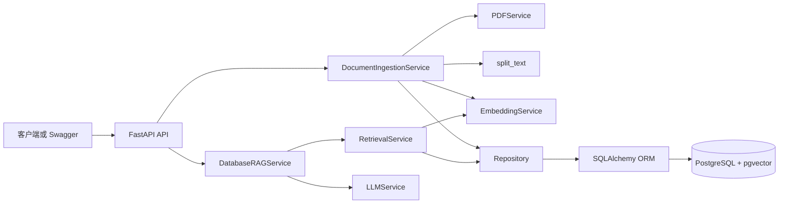
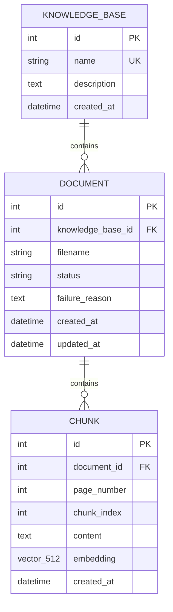

# Enterprise RAG Platform

一个面向企业制度与 SOP 场景的 RAG 后端：支持创建多个知识库、上传多份文本型 PDF、把文档元数据与 512 维向量持久化到 PostgreSQL + pgvector，并在指定知识库内完成带来源问答和证据不足拒答。

当前核心 MVP、可靠性处理、演示数据、固定评测、pytest 回归测试和 Docker Compose 复现流程已经形成。仓库同时保留早期 SQLite + FAISS 接口，用于展示项目从单文档内存 Demo 向多知识库持久化架构的演进。

## 核心能力

- 创建、获取和列出知识库。
- 向指定知识库上传多份 PDF，并查询文档处理状态。
- 按页解析文本型 PDF，使用 `chunk_size=200`、`overlap=40` 切块。
- 使用 `BAAI/bge-small-zh-v1.5` 生成归一化的 512 维向量。
- 将 `KnowledgeBase → Document → Chunk`、页码、原文和向量持久化到 PostgreSQL + pgvector。
- 只在指定知识库和 `ready` 文档内执行余弦相似度 Top-K 检索。
- 返回回答、拒答标记、文档名、页码、Chunk ID、原文和相似度分数。
- 检索证据低于当前生产阈值 `0.55` 时，在调用 LLM 前直接拒答。
- 上传失败时保留安全的 `failed` 状态，不让半成品 Chunk 参与检索。
- 使用 Alembic 管理 `vector` 扩展和三张核心业务表的可回滚迁移。
- 使用 Docker Compose 编排 PostgreSQL、一次性迁移服务和 FastAPI，并通过命名 Volume 保留数据库与模型缓存。
- 提供 4 份可公开虚构制度 PDF、18 道固定问题、参数实验报告和关键 pytest 回归测试。

## 系统架构



主链路分为两条：

```text
文档入库：PDF → API → 解析 → Chunk → Embedding → Repository → PostgreSQL/pgvector
知识库问答：Question → Query Embedding → 范围过滤 Top-K → 阈值拒答或 LLM → Answer + Sources
```

完整的组件职责、入库与问答时序、ER 图和失败边界见 [系统架构说明](docs/architecture.md)。

## 数据模型



`Document.status` 只允许 `pending`、`processing`、`ready`、`failed`。检索查询联结 `Chunk` 与 `Document`，同时过滤知识库 ID 和 `ready` 状态；因此 processing/failed 文档和其他知识库的 Chunk 不会进入回答上下文。

## 技术栈

| 层次 | 技术与当前固定版本 | 职责 |
| --- | --- | --- |
| API | Python 3.11、FastAPI 0.141.1、Uvicorn 0.52.1、Pydantic 2.13.4 | HTTP 接口、依赖注入、输入输出校验 |
| 业务 | Python Service 类 | PDF 入库、检索、阈值拒答、Prompt 和 LLM 编排 |
| 数据访问 | SQLAlchemy 2.0.52、psycopg 3.3.4 | ORM、Session、事务和 PostgreSQL 驱动 |
| 向量数据库 | PostgreSQL 16、pgvector 扩展、Python pgvector 0.5.0 | 结构化数据、`vector(512)` 和余弦距离检索 |
| 迁移 | Alembic 1.19.1 | vector 扩展与业务表版本管理 |
| AI/PDF | sentence-transformers 5.7.0、`BAAI/bge-small-zh-v1.5`、pypdf 6.15.0、HTTPX 0.28.1 | Embedding、文本型 PDF 解析和 LLM API 调用 |
| 质量 | pytest 8.4.2、固定 JSON 数据集 | 业务规则回归与离线检索/拒答实验 |
| 运行 | Dockerfile、Docker Compose | PostgreSQL、迁移、API 和持久化环境复现 |

完整依赖见 [requirements.txt](requirements.txt)，测试附加依赖见 [requirements-test.txt](requirements-test.txt)。

## 企业知识库 API

| 方法 | 路径 | 成功状态 | 作用 |
| --- | --- | --- | --- |
| GET | `/` | 200 | 服务根提示 |
| GET | `/health` | 200 / 503 | 检查数据库连接并报告 LLM 是否配置 |
| POST | `/knowledge-bases` | 201 | 创建唯一名称的知识库 |
| GET | `/knowledge-bases` | 200 | 列出知识库 |
| GET | `/knowledge-bases/{knowledge_base_id}` | 200 | 获取知识库详情 |
| POST | `/knowledge-bases/{knowledge_base_id}/documents` | 201 | 上传并同步处理一份 PDF |
| GET | `/knowledge-bases/{knowledge_base_id}/documents` | 200 | 列出知识库内文档及状态 |
| GET | `/knowledge-bases/{knowledge_base_id}/documents/{document_id}` | 200 | 获取文档详情 |
| POST | `/knowledge-bases/{knowledge_base_id}/query` | 200 | 在指定知识库内检索、拒答或生成带来源回答 |

旧 `/chat`、`/history`、`/request-info`、`/upload` 和 `/rag/chat` 仍保留为第一阶段 SQLite/FAISS 学习链路，不是当前企业知识库主入口。

## 使用 Docker Compose 快速运行

### 1. 准备公开配置

以下命令适用于 Windows PowerShell：

```powershell
git clone https://github.com/lv-xiaoke/enterprise-rag-platform.git
Set-Location enterprise-rag-platform

if (-not (Test-Path -LiteralPath ".env")) {
    Copy-Item -LiteralPath ".env.example" -Destination ".env"
}
```

打开本地 `.env`，至少把 `POSTGRES_PASSWORD` 改为自己的本地值。只有执行生成式问答时才必须填写 `LLM_API_KEY`、`LLM_BASE_URL` 和 `LLM_MODEL`；真实 `.env` 已被 Git 与 Docker 构建上下文忽略，绝不能提交。

### 2. 构建并启动

```powershell
docker compose config --quiet
docker compose up --build -d
docker compose ps --all
```

启动顺序是：

```text
postgres healthy
→ migrate 执行 alembic upgrade head 并以 0 退出
→ api 启动并通过数据库感知的 /health
```

API 首次启动会下载或加载中文 Embedding 模型。Compose 为该缓存提供命名 Volume；首次健康检查可能需要几分钟。

### 3. 检查服务

```powershell
$health = Invoke-RestMethod `
    -Uri "http://127.0.0.1:8000/health" `
    -Method Get

$health | ConvertTo-Json
docker compose exec -T api alembic current
```

数据库可用时，健康响应结构为：

```json
{
  "status": "ok",
  "database_connected": true,
  "llm_configured": false
}
```

`llm_configured` 取决于本地配置，属于动态值；Alembic 当前 head 应为 `e780fe92751b`。

Swagger 地址：<http://127.0.0.1:8000/docs>

## 最小多文档流程

### 1. 创建知识库

```powershell
$createBody = @{
    name = "公开演示制度库"
    description = "只包含仓库内虚构制度 PDF"
} | ConvertTo-Json

$createBytes = [System.Text.Encoding]::UTF8.GetBytes($createBody)

$knowledgeBase = Invoke-RestMethod `
    -Uri "http://127.0.0.1:8000/knowledge-bases" `
    -Method Post `
    -ContentType "application/json; charset=utf-8" `
    -Body $createBytes

$knowledgeBase | ConvertTo-Json
```

知识库 `id` 和时间戳由数据库生成，是动态值。重复使用同名知识库会返回 HTTP 409。

### 2. 上传 4 份虚构 PDF

```powershell
Get-ChildItem -LiteralPath "data\demo_policies\pdfs" -Filter "*.pdf" |
    ForEach-Object {
        curl.exe `
            --fail-with-body `
            -sS `
            -X POST `
            -F "file=@$($_.FullName);type=application/pdf" `
            "http://127.0.0.1:8000/knowledge-bases/$($knowledgeBase.id)/documents"
    }
```

每份成功响应包含 `document`、`page_count` 和 `chunk_count`；ID、数量和时间戳均由实际文件与数据库决定。

### 3. 查询文档状态

```powershell
$documents = Invoke-RestMethod `
    -Uri "http://127.0.0.1:8000/knowledge-bases/$($knowledgeBase.id)/documents" `
    -Method Get

$documents |
    Select-Object id, filename, status, failure_reason |
    Format-Table
```

只有 `status=ready` 的文档参与检索。

### 4. 执行带来源问答

先确认 `.env` 中三个 `LLM_*` 配置都已填写并重新创建 API 容器，然后执行：

```powershell
$queryBody = @{
    question = "连续三天以上年假需要提前多久申请，并经过哪些确认？"
    top_k = 3
} | ConvertTo-Json

$queryBytes = [System.Text.Encoding]::UTF8.GetBytes($queryBody)

$result = Invoke-RestMethod `
    -Uri "http://127.0.0.1:8000/knowledge-bases/$($knowledgeBase.id)/query" `
    -Method Post `
    -ContentType "application/json; charset=utf-8" `
    -Body $queryBytes

$result | ConvertTo-Json -Depth 6
```

稳定响应结构如下；回答、ID、来源数量、原文和分数是动态值：

```json
{
  "answer": "基于当前知识库生成的回答",
  "refused": false,
  "sources": [
    {
      "chunk_id": 1,
      "document_id": 1,
      "filename": "员工请假与考勤制度.pdf",
      "page_number": 1,
      "chunk_index": 3,
      "content": "可回查的原始文本块",
      "score": 0.771898
    }
  ]
}
```

`score` 是余弦相似度，不是答案正确概率。没有来源达到当前阈值时，接口返回 `refused=true`、固定拒答文本和空来源数组，而且不会调用 LLM。

## 测试

测试分为不依赖真实 LLM 的 Service/模型测试，以及需要 PostgreSQL + pgvector 的 Repository 集成测试。数据库启动并迁移到 head 后，在宿主机执行：

```powershell
python -m venv .venv
.\.venv\Scripts\python.exe -m pip install -r requirements-test.txt
.\.venv\Scripts\python.exe -m pytest -q
```

当前用例覆盖：

- `question` 去空格和 `top_k=1..10` 边界。
- 来源字段进入 Prompt 并原样映射回响应。
- 低分证据在调用 LLM 前拒答。
- 知识库隔离、processing/failed 状态过滤、Top-K 数量和相似度排序。
- 每个集成测试使用外层事务并在结束后回滚，减少测试数据污染。

## 固定评测

评测语料由 4 份两页虚构制度 PDF 组成，数据集版本为 `2026-09-04-v1`，包含 12 道可回答题和 6 道无答案题。评测脚本复用生产的 `SessionLocal → RetrievalService → ChunkRepository`，但不调用 LLM，从而隔离检索、阈值和延迟变量。

| Top-K | Recall@K | MRR@K | 完整证据题占比 |
| ---: | ---: | ---: | ---: |
| 1 | 0.616667 | 0.916667 | 0.416667 |
| 3 | 0.972222 | 0.958333 | 0.916667 |
| 5 | 0.972222 | 0.958333 | 0.916667 |

固定选参规则在候选组合中推荐 `Top-K=3、threshold=0.65`：平衡拒答准确率 `0.958333`，总体拒答正确率 `0.944444`。该阈值是离线实验建议，当前 `DatabaseRAGService` 仍使用 `0.55`，尚未作为生产配置变更落地。

36 个预热后 “Query Embedding + pgvector Top-K” 样本的平均延迟为 `12.797136 ms`，P95 为 `15.2546 ms`。这些值来自小型本地数据集，不包含模型初始化、HTTP 和 LLM 生成，不能解释为生产 SLA。

详见 [评测报告](docs/evaluation-report.md) 和 [结构化源报告](data/evaluation/enterprise_evaluation_report.json)。

复现入口：

```powershell
.\.venv\Scripts\python.exe scripts\validate_enterprise_questions.py
.\.venv\Scripts\python.exe scripts\run_evaluation.py `
    --knowledge-base-id $knowledgeBase.id `
    --repetitions 2
```

目标知识库必须已经成功入库仓库内 4 份冻结 PDF。

## 项目结构

```text
enterprise-rag-platform/
├── app/
│   ├── main.py                         # FastAPI 与错误映射
│   ├── db.py                           # Engine、Session、连接探针
│   ├── models.py                       # Pydantic 请求/响应模型
│   ├── orm_models.py                   # KnowledgeBase、Document、Chunk
│   ├── repositories/                   # 数据访问与 pgvector 查询
│   └── services/                       # 入库、检索、RAG、PDF、Embedding、LLM
├── migrations/versions/                # vector 扩展和三表迁移
├── tests/                              # 模型、Service 与真实数据库集成测试
├── scripts/                            # 演示 PDF、数据校验和参数实验脚本
├── data/
│   ├── demo_policies/                  # 可重建的虚构制度 PDF 与清单
│   └── evaluation/                     # 固定问题、基线与结构化报告
├── docs/
│   ├── architecture.md                 # 系统架构与数据流
│   └── evaluation-report.md            # 评测摘要、失败案例与限制
├── .env.example                        # 无真实秘密的公开配置模板
├── Dockerfile
├── docker-compose.yml
├── requirements.txt
└── README.md
```

## 关键设计选择

- 使用 PostgreSQL + pgvector 同时保存业务关系、原文、页码和向量，避免内存 FAISS 索引与元数据映射分离且重启丢失。
- Repository 只负责数据访问，Service 负责编排 PDF、Embedding、事务、状态和 LLM；FastAPI 负责协议校验与 HTTP 错误映射。
- 入库先提交 `processing` Document，再在一个事务中写入全部 Chunk 并切换为 `ready`；失败时回滚半成品并单独提交安全的 `failed` 状态。
- 文档向量和查询向量都归一化，pgvector 查询使用余弦距离并转换为 `score = 1 - distance`。
- 检索在 SQL 层同时限定知识库 ID 和 `Document.status='ready'`，避免跨知识库或未完成文档污染上下文。
- 阈值拒答发生在 LLM 调用之前，降低没有可靠证据时的幻觉和无效外部调用。
- Alembic 负责数据库版本历史；Docker Compose 明确 PostgreSQL healthy、迁移成功、API ready 三个阶段。

## 已知限制

- 只支持带文字层的 PDF；不支持 OCR、扫描件、图片、复杂表格或多模态解析。
- 文档在上传请求中同步解析与生成 Embedding；大文件可能长时间占用请求，当前没有异步队列和任务进度接口。
- Embedding 模型在应用导入时加载，首次启动需要下载或读取模型缓存，启动时间与内存占用较高。
- 当前没有登录、权限、租户授权、限流、审计日志或管理前端；知识库 ID 过滤不等于访问控制。
- 当前 pgvector 查询没有 HNSW/IVFFlat ANN 索引，尚未进行大规模语料和并发压测。
- 离线实验推荐阈值 `0.65`，生产代码仍使用 `0.55`；任何参数同步都需要独立提交并重跑回归与评测。
- 固定评测只衡量检索、证据覆盖、阈值分类和检索延迟，不衡量真实 LLM 答案的正确性与生成延迟。
- 评测规模只有 4 份虚构 PDF 和 18 道人工问题，指标不能外推为生产通用准确率或 SLA。
- 旧 SQLite/FAISS 接口仍在同一个 `app/main.py` 中，后续可以在保持兼容或完成迁移后单独清理。

## 安全边界

- `.env` 与 `.env.*` 默认被 Git 忽略，只有 `.env.example` 可以提交。
- `.dockerignore` 排除本地环境、秘密、测试、学习资料和本地数据，真实密钥不会进入构建上下文。
- 数据库与上游异常通过固定 HTTP 文本返回，不应回显密码、完整数据库 URL、API Key、驱动堆栈或内部异常对象。
- 演示 PDF 全部为虚构内容，不包含真实企业制度、姓名、证件、账户或合同信息。

## 文档与证据

- [系统架构说明](docs/architecture.md)
- [评测报告](docs/evaluation-report.md)
- [结构化评测源报告](data/evaluation/enterprise_evaluation_report.json)
- [固定评测集](data/evaluation/enterprise_questions.json)
- [演示数据说明](data/demo_policies/README.md)
- [核心 ORM](app/orm_models.py)
- [数据库版入库服务](app/services/document_ingestion_service.py)
- [pgvector 检索](app/repositories/chunk_repository.py)
- [数据库版 RAG](app/services/database_rag_service.py)
- [Docker Compose](docker-compose.yml)

## 项目定位

这是一个以可运行代码、失败安全、可复现评测和可核对来源为主线的学习型企业 RAG 后端。当前仓库适合本地演示、架构讲解和小规模实验，不把尚未完成的生产化能力包装成现成功能。