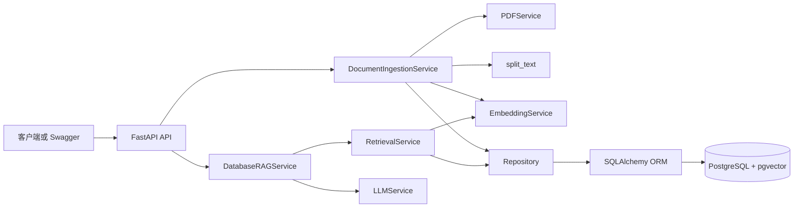
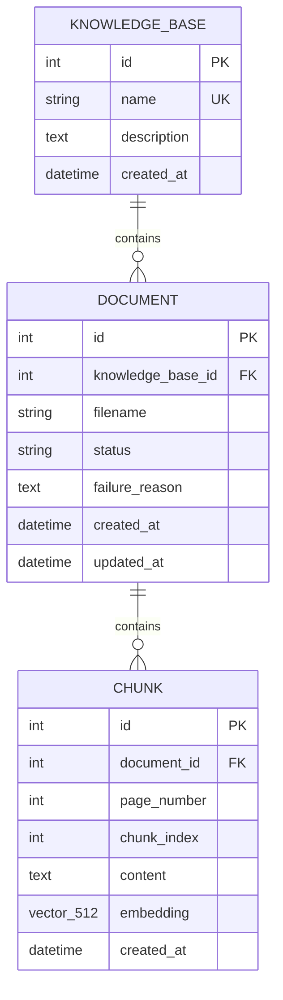
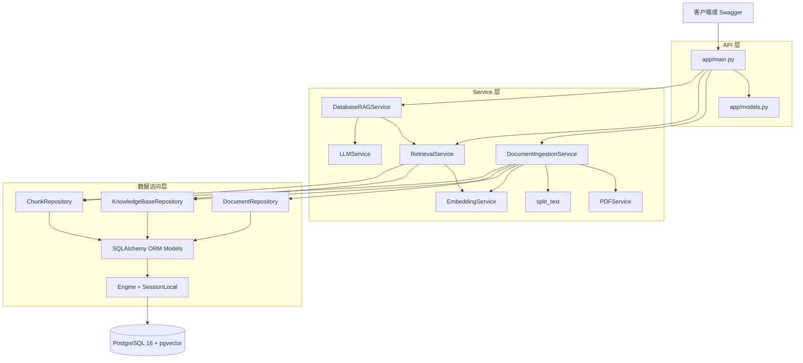
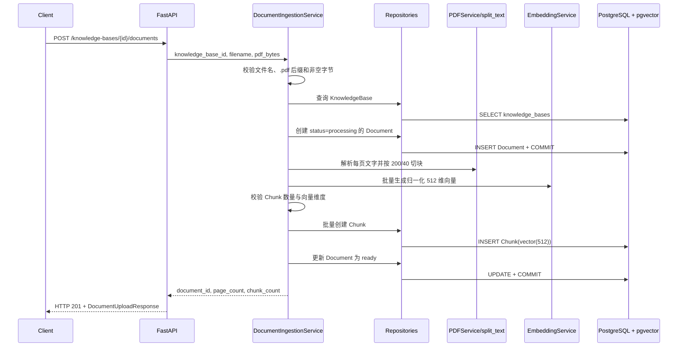
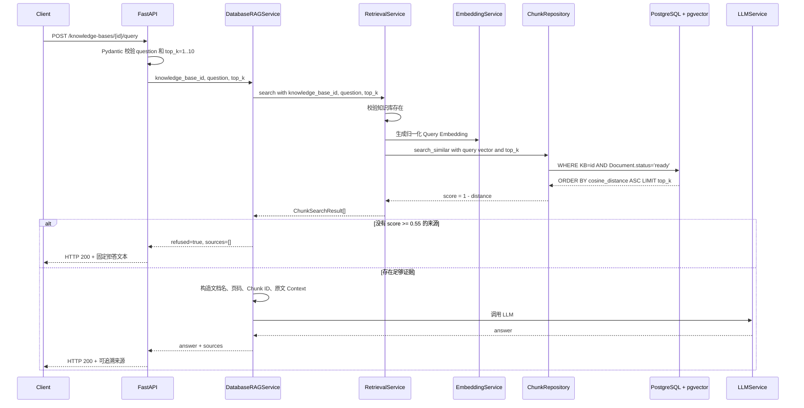
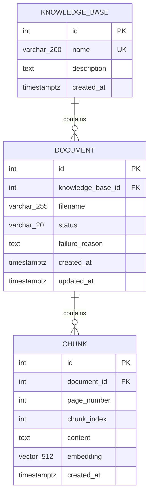

# Day 15：完成求职版 README、架构图和评测报告

今天将直接把已经完成的 PostgreSQL + pgvector 企业 RAG 实现、可复现运行流程和真实参数实验整理成求职版 README、系统架构图与评测报告，使项目获得可阅读、可运行、可核对的公开说明，并为面试中的架构设计、技术取舍和量化结果问题提供项目依据。

> 预计核心用时：约 60 分钟  
> 今日唯一核心产物：互相引用且事实一致的 `README.md`、`docs/architecture.md` 和 `docs/evaluation-report.md`  
> 当前真实状态：已完成 
> 对应总体安排：Day 15

## 一、今天完成后的项目变化

### 升级前

```text
README 仍把项目描述为单 PDF + 内存 FAISS Demo
→ API 表、运行命令、项目结构和限制均停留在旧架构
→ PostgreSQL/pgvector、多知识库、多文档、状态过滤和拒答没有形成公开说明
→ 真实的 18 题参数实验只存在于 3,506 行 JSON 报告中
→ 招聘方无法快速判断系统边界、复现方法和指标可信度
```

### 升级后

```text
当前代码、迁移、测试和运行配置
→ README 概括项目价值、核心能力、API、复现步骤和已知限制
→ architecture.md 展开两条运行链路、分层职责、事务和持久化边界
→ evaluation-report.md 把固定数据集、Recall/MRR、拒答、延迟和失败案例写清楚
→ 三份文档互相链接，并共同引用 JSON 源报告
→ 招聘方能够理解项目，使用者能够运行项目，面试时能够追溯每项结论
```

### 今天在完整项目中的位置

- 所属阶段：求职输出。
- 所属链路：把已完成的两条核心运行链路转化为公开、可核对的项目说明。
- 今天的输入：Day 1～Day 14 的当前代码、两条 Alembic 迁移、Docker Compose、4 份虚构 PDF、18 题固定评测集、结构化评测报告和 pytest 用例。
- 今天的输出：求职版 `README.md`、独立架构说明 `docs/architecture.md`、独立评测摘要 `docs/evaluation-report.md`。
- 下一天为什么需要它：Day 16 要直接沿用 README 主线、架构图和有证据的指标编写三分钟演示与简历项目条目。

## 二、开始前的真实状态

### 已经具备

- `[当前事实]` Day 1～Day 14 均存在核心产物、用户完成标记和匹配 Git 提交；最新匹配提交为 Day 14 的 `923ffcc`。
- `[当前事实]` 生成本计划前 `git status --short` 无输出，工作区没有已识别的未提交修改。
- `[当前事实]` `app/orm_models.py` 已定义 `KnowledgeBase 1:N Document 1:N Chunk`，包含状态、外键、约束、索引和 `Vector(512)`。
- `[当前事实]` `app/services/document_ingestion_service.py` 已把文本型 PDF 解析、`200/40` 字符切块、512 维 Embedding、Chunk 批量写入和 Document 状态转换串成数据库入库流程。
- `[当前事实]` `app/repositories/chunk_repository.py` 使用 pgvector 余弦距离，并只返回指定知识库内 `ready` 文档的 Chunk。
- `[当前事实]` `app/services/database_rag_service.py` 返回可追溯来源；低于当前 `0.55` 阈值时在调用 LLM 前拒答。
- `[当前事实]` `app/main.py` 已开放知识库创建/列表/详情、文档上传/列表/详情和指定知识库问答 API，同时保留旧 FAISS 接口作为演进对照。
- `[当前事实]` `docker-compose.yml` 定义 `postgres → migrate → api` 启动依赖、数据库与 Hugging Face 命名 Volume，以及数据库感知的 `/health`。
- `[当前事实]` `data/demo_policies/pdfs/` 已有 4 份可公开虚构 PDF；`data/evaluation/enterprise_questions.json` 已固定 12 道可回答题和 6 道无答案题。
- `[当前事实]` `data/evaluation/enterprise_evaluation_report.json` 是一次真实运行产物：18/18 题完成、Top-3 Recall 为 `0.972222`、MRR 为 `0.958333`、36 个检索样本 P95 为 `15.2546 ms`。
- `[当前事实]` 离线报告按固定规则推荐 `Top-K=3、threshold=0.65`；当前生产代码仍使用 `Top-K=3、threshold=0.55`，今天只能如实说明差异，不能把 `0.65` 写成已经部署。
- `[当前事实]` `tests/` 已覆盖请求边界、来源与拒答、知识库隔离、文档状态过滤、Top-K 和排序；当前测试清单展开后应为 7 个 pytest case。

### 仍然缺少

- `[当前事实]` 根目录 `README.md` 仍以 “Mini RAG Backend” 为标题，主要描述 SQLite + 单 PDF + 内存 FAISS，API、Docker、评测与已知限制均已过时。
- `[当前事实]` 当前不存在 `docs/architecture.md`，没有可独立引用的分层图、入库时序、问答时序和 ER 图。
- `[当前事实]` 当前不存在 `docs/evaluation-report.md`，真实 JSON 指标、实验口径、失败案例与限制没有形成便于阅读的摘要。
- `[当前事实]` README 中的 GitHub 地址仍指向旧仓库 `260804_mini-rag-backend`，当前 Git remote 是 `https://github.com/lv-xiaoke/enterprise-rag-platform.git`。

### 待实测

- `[待实测]` 三份 Markdown 在 GitHub/Codex 的 Mermaid 渲染、表格和相对链接是否正常。
- `[待实测]` 按新 README 从公开 `.env.example` 启动时，Compose 配置、健康检查、迁移和最小知识库流程是否仍与 Day 14 一致。
- `[待实测]` 当前环境重新运行 pytest 是否得到 7 个 case 全部通过；实际执行与回填结果可选。
- `[待实测]` 未来重新生成评测报告后，文档中的固定指标是否需要版本化更新。

### 需要保护的用户修改

- 当前工作区干净；只修改今天明确列出的四个文件，不处理旧学习资料、演示 PDF、JSON 源报告、应用代码、迁移、测试或其他用户笔记。

## 三、今天必须理解的核心知识

### 1. 求职版 README 是可验证入口，不是功能愿望清单

- 一句话解释：README 的每项能力、命令和数字都必须能追溯到当前代码、配置或运行产物。
- 在当前项目中的职责：它把知识库 API、PDF 入库、pgvector 检索、来源、拒答、Docker 复现和评测证据组织成招聘方可以快速核对的主线。
- 与其他组件的关系：README 链接架构说明和评测摘要；详细结论再链接到 ORM、Service、Repository、测试与 JSON 源报告。
- 容易混淆的点：“代码可以支持”与“已经在某环境实测成功”不是同一类事实；“实验推荐阈值”与“生产代码当前阈值”也不能混写。
- 面试一句话：我的 README 只描述仓库当前实现，并为架构、命令和指标提供文件级证据，不把计划能力或推荐参数包装成已上线事实。

### 2. 架构图要同时表达分层和两条数据流

- 一句话解释：组件图回答“谁负责什么”，时序图回答“一次请求怎样流动”。
- 在当前项目中的职责：组件图对应 `API → Service → Repository → SQLAlchemy → PostgreSQL/pgvector`，两个时序图分别覆盖文档入库和知识库问答。
- 与其他组件的关系：ER 图补充 `KnowledgeBase → Document → Chunk` 的持久化关系；失败路径说明 processing/failed、rollback 和拒答边界。
- 容易混淆的点：不能把 `Repository` 画成业务编排层，也不能把 pgvector 画成独立于 PostgreSQL 的第二个数据库。
- 面试一句话：我用分层图解释职责，用入库与问答时序解释调用顺序，再用 ER 图说明来源追溯和知识库隔离依赖的数据关系。

### 3. 指标必须带数据集、口径和限制

- 一句话解释：没有评测集规模、计算范围和失败案例的单个百分比没有可信含义。
- 在当前项目中的职责：18 题固定集、4 份冻结 PDF、Top-K/threshold 参数矩阵、36 个预热后检索延迟样本共同定义结果边界。
- 与其他组件的关系：Recall/MRR 来自 `RetrievalService → ChunkRepository` 的真实 Query Embedding 与 pgvector 查询；本次评测不调用 LLM，因此不衡量生成答案正确率。
- 容易混淆的点：`0.972222` 是固定小数据集上的证据 Recall@3，不是系统通用准确率；`15.2546 ms` 是检索 P95，不是 HTTP + LLM 端到端 SLA。
- 面试一句话：我的指标都注明了 4 份虚构 PDF、18 道题、预热后检索口径和真实失败案例，所以它们是可复现项目基线，而不是生产准确率承诺。

### 4. 已知限制会增加可信度

- 一句话解释：明确边界能证明你理解系统尚未解决的问题和扩展成本。
- 在当前项目中的职责：README 应明确只支持文本型 PDF、同步入库、无认证、无 ANN 索引、Embedding 启动成本、旧接口仍保留，以及离线推荐阈值尚未同步到生产代码。
- 与其他组件的关系：这些限制分别能定位到 `PDFService`、`app/main.py`、`ChunkRepository`、`EmbeddingService` 和 `DatabaseRAGService`。
- 容易混淆的点：限制不是“后续优化”口号；应指出当前事实和下一步需要重新验证的内容。
- 面试一句话：我会主动说明系统当前适合小规模企业制度演示，生产化仍需异步任务、认证授权、索引与性能测试、监控以及参数变更回归。

## 四、升级涉及的文件

| 文件 | 操作 | 作用 |
| --- | --- | --- |
| `README.md` | 完整替换 | 项目定位、核心能力、架构入口、API、快速开始、测试评测、限制和证据索引 |
| `docs/architecture.md` | 新建 | 独立展示分层职责、两条时序、ER 关系、失败边界和持久化边界 |
| `docs/evaluation-report.md` | 新建 | 摘要真实 JSON 报告的实验设置、指标、选参结论、失败案例和适用范围 |
| `docs/17天每日学习/Day15.md` | 保留并按需更新执行记录 | 今天的可执行升级手册、可选记录和提交边界 |

### 今日不做

- 不修改 `MIN_RELEVANCE_SCORE=0.55` 为实验推荐的 `0.65`；参数落地属于后续独立代码变更，必须配套 API 与测试回归。
- 不重构旧 `/upload`、`/rag/chat`、`/chat` 或 SQLite 链路，只在文档中标为兼容/演进对照接口。
- 不新增认证、前端、异步任务、ANN 索引、监控或部署平台。
- 不重新运行并覆盖结构化评测报告；今天只准确引用已存在的 `2026-09-04-v1` 数据集和报告。
- 不编写 Day 16 的演示视频脚本或简历条目。

## 五、按顺序完成项目升级

### 步骤 1：完整替换求职版 README（建议 18 分钟）

**目标**

让根目录首页准确呈现 PostgreSQL + pgvector 企业 RAG 主线，并给出可以复现、验证和继续深挖的入口。

**修改位置**

- 文件：`README.md`
- 定位：当前第一行 `# Mini RAG Backend`
- 操作：完整替换整个文件；如果你在旧 README 中另加了仍然有效的个人说明，先单独保存并在完成替换后人工合并。

**复制下面的完整代码**

````markdown
# Enterprise RAG Platform

一个面向企业制度与 SOP 场景的 RAG 后端：支持创建多个知识库、上传多份文本型 PDF、把文档元数据与 512 维向量持久化到 PostgreSQL + pgvector，并在指定知识库内完成带来源问答和证据不足拒答。

当前核心 MVP、可靠性处理、演示数据、固定评测、pytest 回归测试和 Docker Compose 复现流程已经形成。仓库同时保留早期 SQLite + FAISS 接口，用于展示项目从单文档内存 Demo 向多知识库持久化架构的演进。

## 核心能力

- 创建、获取和列出知识库。
- 向指定知识库上传多份 PDF，并查询文档处理状态。
- 按页解析文本型 PDF，使用 `chunk_size=200`、`overlap=40` 切块。
- 使用 `BAAI/bge-small-zh-v1.5` 生成归一化的 512 维向量。
- 将 `KnowledgeBase → Document → Chunk`、页码、原文和向量持久化到 PostgreSQL + pgvector。
- 只在指定知识库和 `ready` 文档内执行余弦相似度 Top-K 检索。
- 返回回答、拒答标记、文档名、页码、Chunk ID、原文和相似度分数。
- 检索证据低于当前生产阈值 `0.55` 时，在调用 LLM 前直接拒答。
- 上传失败时保留安全的 `failed` 状态，不让半成品 Chunk 参与检索。
- 使用 Alembic 管理 `vector` 扩展和三张核心业务表的可回滚迁移。
- 使用 Docker Compose 编排 PostgreSQL、一次性迁移服务和 FastAPI，并通过命名 Volume 保留数据库与模型缓存。
- 提供 4 份可公开虚构制度 PDF、18 道固定问题、参数实验报告和关键 pytest 回归测试。

## 系统架构



主链路分为两条：

```text
文档入库：PDF → API → 解析 → Chunk → Embedding → Repository → PostgreSQL/pgvector
知识库问答：Question → Query Embedding → 范围过滤 Top-K → 阈值拒答或 LLM → Answer + Sources
```

完整的组件职责、入库与问答时序、ER 图和失败边界见 [系统架构说明](docs/architecture.md)。

## 数据模型



`Document.status` 只允许 `pending`、`processing`、`ready`、`failed`。检索查询联结 `Chunk` 与 `Document`，同时过滤知识库 ID 和 `ready` 状态；因此 processing/failed 文档和其他知识库的 Chunk 不会进入回答上下文。

## 技术栈

| 层次 | 技术与当前固定版本 | 职责 |
| --- | --- | --- |
| API | Python 3.11、FastAPI 0.141.1、Uvicorn 0.52.1、Pydantic 2.13.4 | HTTP 接口、依赖注入、输入输出校验 |
| 业务 | Python Service 类 | PDF 入库、检索、阈值拒答、Prompt 和 LLM 编排 |
| 数据访问 | SQLAlchemy 2.0.52、psycopg 3.3.4 | ORM、Session、事务和 PostgreSQL 驱动 |
| 向量数据库 | PostgreSQL 16、pgvector 扩展、Python pgvector 0.5.0 | 结构化数据、`vector(512)` 和余弦距离检索 |
| 迁移 | Alembic 1.19.1 | vector 扩展与业务表版本管理 |
| AI/PDF | sentence-transformers 5.7.0、`BAAI/bge-small-zh-v1.5`、pypdf 6.15.0、HTTPX 0.28.1 | Embedding、文本型 PDF 解析和 LLM API 调用 |
| 质量 | pytest 8.4.2、固定 JSON 数据集 | 业务规则回归与离线检索/拒答实验 |
| 运行 | Dockerfile、Docker Compose | PostgreSQL、迁移、API 和持久化环境复现 |

完整依赖见 [requirements.txt](requirements.txt)，测试附加依赖见 [requirements-test.txt](requirements-test.txt)。

## 企业知识库 API

| 方法 | 路径 | 成功状态 | 作用 |
| --- | --- | --- | --- |
| GET | `/` | 200 | 服务根提示 |
| GET | `/health` | 200 / 503 | 检查数据库连接并报告 LLM 是否配置 |
| POST | `/knowledge-bases` | 201 | 创建唯一名称的知识库 |
| GET | `/knowledge-bases` | 200 | 列出知识库 |
| GET | `/knowledge-bases/{knowledge_base_id}` | 200 | 获取知识库详情 |
| POST | `/knowledge-bases/{knowledge_base_id}/documents` | 201 | 上传并同步处理一份 PDF |
| GET | `/knowledge-bases/{knowledge_base_id}/documents` | 200 | 列出知识库内文档及状态 |
| GET | `/knowledge-bases/{knowledge_base_id}/documents/{document_id}` | 200 | 获取文档详情 |
| POST | `/knowledge-bases/{knowledge_base_id}/query` | 200 | 在指定知识库内检索、拒答或生成带来源回答 |

旧 `/chat`、`/history`、`/request-info`、`/upload` 和 `/rag/chat` 仍保留为第一阶段 SQLite/FAISS 学习链路，不是当前企业知识库主入口。

## 使用 Docker Compose 快速运行

### 1. 准备公开配置

以下命令适用于 Windows PowerShell：

```powershell
git clone https://github.com/lv-xiaoke/enterprise-rag-platform.git
Set-Location enterprise-rag-platform

if (-not (Test-Path -LiteralPath ".env")) {
    Copy-Item -LiteralPath ".env.example" -Destination ".env"
}
```

打开本地 `.env`，至少把 `POSTGRES_PASSWORD` 改为自己的本地值。只有执行生成式问答时才必须填写 `LLM_API_KEY`、`LLM_BASE_URL` 和 `LLM_MODEL`；真实 `.env` 已被 Git 与 Docker 构建上下文忽略，绝不能提交。

### 2. 构建并启动

```powershell
docker compose config --quiet
docker compose up --build -d
docker compose ps --all
```

启动顺序是：

```text
postgres healthy
→ migrate 执行 alembic upgrade head 并以 0 退出
→ api 启动并通过数据库感知的 /health
```

API 首次启动会下载或加载中文 Embedding 模型。Compose 为该缓存提供命名 Volume；首次健康检查可能需要几分钟。

### 3. 检查服务

```powershell
$health = Invoke-RestMethod `
    -Uri "http://127.0.0.1:8000/health" `
    -Method Get

$health | ConvertTo-Json
docker compose exec -T api alembic current
```

数据库可用时，健康响应结构为：

```json
{
  "status": "ok",
  "database_connected": true,
  "llm_configured": false
}
```

`llm_configured` 取决于本地配置，属于动态值；Alembic 当前 head 应为 `e780fe92751b`。

Swagger 地址：<http://127.0.0.1:8000/docs>

## 最小多文档流程

### 1. 创建知识库

```powershell
$createBody = @{
    name = "公开演示制度库"
    description = "只包含仓库内虚构制度 PDF"
} | ConvertTo-Json

$createBytes = [System.Text.Encoding]::UTF8.GetBytes($createBody)

$knowledgeBase = Invoke-RestMethod `
    -Uri "http://127.0.0.1:8000/knowledge-bases" `
    -Method Post `
    -ContentType "application/json; charset=utf-8" `
    -Body $createBytes

$knowledgeBase | ConvertTo-Json
```

知识库 `id` 和时间戳由数据库生成，是动态值。重复使用同名知识库会返回 HTTP 409。

### 2. 上传 4 份虚构 PDF

```powershell
Get-ChildItem -LiteralPath "data\demo_policies\pdfs" -Filter "*.pdf" |
    ForEach-Object {
        curl.exe `
            --fail-with-body `
            -sS `
            -X POST `
            -F "file=@$($_.FullName);type=application/pdf" `
            "http://127.0.0.1:8000/knowledge-bases/$($knowledgeBase.id)/documents"
    }
```

每份成功响应包含 `document`、`page_count` 和 `chunk_count`；ID、数量和时间戳均由实际文件与数据库决定。

### 3. 查询文档状态

```powershell
$documents = Invoke-RestMethod `
    -Uri "http://127.0.0.1:8000/knowledge-bases/$($knowledgeBase.id)/documents" `
    -Method Get

$documents |
    Select-Object id, filename, status, failure_reason |
    Format-Table
```

只有 `status=ready` 的文档参与检索。

### 4. 执行带来源问答

先确认 `.env` 中三个 `LLM_*` 配置都已填写并重新创建 API 容器，然后执行：

```powershell
$queryBody = @{
    question = "连续三天以上年假需要提前多久申请，并经过哪些确认？"
    top_k = 3
} | ConvertTo-Json

$queryBytes = [System.Text.Encoding]::UTF8.GetBytes($queryBody)

$result = Invoke-RestMethod `
    -Uri "http://127.0.0.1:8000/knowledge-bases/$($knowledgeBase.id)/query" `
    -Method Post `
    -ContentType "application/json; charset=utf-8" `
    -Body $queryBytes

$result | ConvertTo-Json -Depth 6
```

稳定响应结构如下；回答、ID、来源数量、原文和分数是动态值：

```json
{
  "answer": "基于当前知识库生成的回答",
  "refused": false,
  "sources": [
    {
      "chunk_id": 1,
      "document_id": 1,
      "filename": "员工请假与考勤制度.pdf",
      "page_number": 1,
      "chunk_index": 3,
      "content": "可回查的原始文本块",
      "score": 0.771898
    }
  ]
}
```

`score` 是余弦相似度，不是答案正确概率。没有来源达到当前阈值时，接口返回 `refused=true`、固定拒答文本和空来源数组，而且不会调用 LLM。

## 测试

测试分为不依赖真实 LLM 的 Service/模型测试，以及需要 PostgreSQL + pgvector 的 Repository 集成测试。数据库启动并迁移到 head 后，在宿主机执行：

```powershell
python -m venv .venv
.\.venv\Scripts\python.exe -m pip install -r requirements-test.txt
.\.venv\Scripts\python.exe -m pytest -q
```

当前用例覆盖：

- `question` 去空格和 `top_k=1..10` 边界。
- 来源字段进入 Prompt 并原样映射回响应。
- 低分证据在调用 LLM 前拒答。
- 知识库隔离、processing/failed 状态过滤、Top-K 数量和相似度排序。
- 每个集成测试使用外层事务并在结束后回滚，减少测试数据污染。

## 固定评测

评测语料由 4 份两页虚构制度 PDF 组成，数据集版本为 `2026-09-04-v1`，包含 12 道可回答题和 6 道无答案题。评测脚本复用生产的 `SessionLocal → RetrievalService → ChunkRepository`，但不调用 LLM，从而隔离检索、阈值和延迟变量。

| Top-K | Recall@K | MRR@K | 完整证据题占比 |
| ---: | ---: | ---: | ---: |
| 1 | 0.616667 | 0.916667 | 0.416667 |
| 3 | 0.972222 | 0.958333 | 0.916667 |
| 5 | 0.972222 | 0.958333 | 0.916667 |

固定选参规则在候选组合中推荐 `Top-K=3、threshold=0.65`：平衡拒答准确率 `0.958333`，总体拒答正确率 `0.944444`。该阈值是离线实验建议，当前 `DatabaseRAGService` 仍使用 `0.55`，尚未作为生产配置变更落地。

36 个预热后 “Query Embedding + pgvector Top-K” 样本的平均延迟为 `12.797136 ms`，P95 为 `15.2546 ms`。这些值来自小型本地数据集，不包含模型初始化、HTTP 和 LLM 生成，不能解释为生产 SLA。

详见 [评测报告](docs/evaluation-report.md) 和 [结构化源报告](data/evaluation/enterprise_evaluation_report.json)。

复现入口：

```powershell
.\.venv\Scripts\python.exe scripts\validate_enterprise_questions.py
.\.venv\Scripts\python.exe scripts\run_evaluation.py `
    --knowledge-base-id $knowledgeBase.id `
    --repetitions 2
```

目标知识库必须已经成功入库仓库内 4 份冻结 PDF。

## 项目结构

```text
enterprise-rag-platform/
├── app/
│   ├── main.py                         # FastAPI 与错误映射
│   ├── db.py                           # Engine、Session、连接探针
│   ├── models.py                       # Pydantic 请求/响应模型
│   ├── orm_models.py                   # KnowledgeBase、Document、Chunk
│   ├── repositories/                   # 数据访问与 pgvector 查询
│   └── services/                       # 入库、检索、RAG、PDF、Embedding、LLM
├── migrations/versions/                # vector 扩展和三表迁移
├── tests/                              # 模型、Service 与真实数据库集成测试
├── scripts/                            # 演示 PDF、数据校验和参数实验脚本
├── data/
│   ├── demo_policies/                  # 可重建的虚构制度 PDF 与清单
│   └── evaluation/                     # 固定问题、基线与结构化报告
├── docs/
│   ├── architecture.md                 # 系统架构与数据流
│   └── evaluation-report.md            # 评测摘要、失败案例与限制
├── .env.example                        # 无真实秘密的公开配置模板
├── Dockerfile
├── docker-compose.yml
├── requirements.txt
└── README.md
```

## 关键设计选择

- 使用 PostgreSQL + pgvector 同时保存业务关系、原文、页码和向量，避免内存 FAISS 索引与元数据映射分离且重启丢失。
- Repository 只负责数据访问，Service 负责编排 PDF、Embedding、事务、状态和 LLM；FastAPI 负责协议校验与 HTTP 错误映射。
- 入库先提交 `processing` Document，再在一个事务中写入全部 Chunk 并切换为 `ready`；失败时回滚半成品并单独提交安全的 `failed` 状态。
- 文档向量和查询向量都归一化，pgvector 查询使用余弦距离并转换为 `score = 1 - distance`。
- 检索在 SQL 层同时限定知识库 ID 和 `Document.status='ready'`，避免跨知识库或未完成文档污染上下文。
- 阈值拒答发生在 LLM 调用之前，降低没有可靠证据时的幻觉和无效外部调用。
- Alembic 负责数据库版本历史；Docker Compose 明确 PostgreSQL healthy、迁移成功、API ready 三个阶段。

## 已知限制

- 只支持带文字层的 PDF；不支持 OCR、扫描件、图片、复杂表格或多模态解析。
- 文档在上传请求中同步解析与生成 Embedding；大文件可能长时间占用请求，当前没有异步队列和任务进度接口。
- Embedding 模型在应用导入时加载，首次启动需要下载或读取模型缓存，启动时间与内存占用较高。
- 当前没有登录、权限、租户授权、限流、审计日志或管理前端；知识库 ID 过滤不等于访问控制。
- 当前 pgvector 查询没有 HNSW/IVFFlat ANN 索引，尚未进行大规模语料和并发压测。
- 离线实验推荐阈值 `0.65`，生产代码仍使用 `0.55`；任何参数同步都需要独立提交并重跑回归与评测。
- 固定评测只衡量检索、证据覆盖、阈值分类和检索延迟，不衡量真实 LLM 答案的正确性与生成延迟。
- 评测规模只有 4 份虚构 PDF 和 18 道人工问题，指标不能外推为生产通用准确率或 SLA。
- 旧 SQLite/FAISS 接口仍在同一个 `app/main.py` 中，后续可以在保持兼容或完成迁移后单独清理。

## 安全边界

- `.env` 与 `.env.*` 默认被 Git 忽略，只有 `.env.example` 可以提交。
- `.dockerignore` 排除本地环境、秘密、测试、学习资料和本地数据，真实密钥不会进入构建上下文。
- 数据库与上游异常通过固定 HTTP 文本返回，不应回显密码、完整数据库 URL、API Key、驱动堆栈或内部异常对象。
- 演示 PDF 全部为虚构内容，不包含真实企业制度、姓名、证件、账户或合同信息。

## 文档与证据

- [系统架构说明](docs/architecture.md)
- [评测报告](docs/evaluation-report.md)
- [结构化评测源报告](data/evaluation/enterprise_evaluation_report.json)
- [固定评测集](data/evaluation/enterprise_questions.json)
- [演示数据说明](data/demo_policies/README.md)
- [核心 ORM](app/orm_models.py)
- [数据库版入库服务](app/services/document_ingestion_service.py)
- [pgvector 检索](app/repositories/chunk_repository.py)
- [数据库版 RAG](app/services/database_rag_service.py)
- [Docker Compose](docker-compose.yml)

## 项目定位

这是一个以可运行代码、失败安全、可复现评测和可核对来源为主线的学习型企业 RAG 后端。当前仓库适合本地演示、架构讲解和小规模实验，不把尚未完成的生产化能力包装成现成功能。
````

**这段代码怎样工作**

- 输入：当前 API、ORM、Service、Repository、Compose、测试、演示数据和真实 JSON 报告。
- 输出：一个公开入口，先说明项目价值，再提供架构、运行、API、测试、评测、限制和证据链接。
- 调用谁：README 不参与运行时调用；它链接 `docs/architecture.md`、`docs/evaluation-report.md` 和真实代码/数据文件。
- 被谁调用：GitHub 项目首页、Day 16 演示脚本、简历项目描述和技术面试复盘。
- 正常路径：读者能从首页理解两条链路，按 Compose 命令启动，再沿链接核对架构与指标。
- 失败路径：若指标、链接、端点或参数状态与源码不一致，后面的静态审计会退出非零，阻止提交虚假说明。

**完成本步骤后的预期状态**

- README 不再把项目主架构描述成单 PDF 内存 FAISS。
- 当前企业 API、`vector(512)`、ready 过滤、拒答、Compose 与评测口径均有准确入口。
- 旧接口被明确标为演进对照，没有被误删或冒充新架构。

### 步骤 2：新建独立系统架构说明（建议 10 分钟）

**目标**

用组件图、两条时序图和 ER 图把当前代码职责、事务边界、失败路径与持久化边界完整映射出来。

**修改位置**

- 文件：`docs/architecture.md`
- 定位：当前不存在
- 操作：新建完整文件

**复制下面的完整代码**

````markdown
# Enterprise RAG Platform 系统架构

本文只描述当前仓库已经存在的 PostgreSQL + pgvector 企业知识库链路；旧 SQLite 普通聊天和单 PDF FAISS 接口作为兼容/演进对照保留，不属于本架构主线。

## 1. 目标与边界

当前系统解决两个核心问题：

```text
文档入库：企业文本型 PDF 怎样成为可持久化、可检索、可追溯的数据？
知识库问答：用户问题怎样只在指定知识库的 ready 文档内找到证据并生成回答？
```

当前不包含 OCR、复杂表格、多模态、异步任务、认证授权、管理前端、ANN 向量索引和生产监控。

## 2. 分层组件图



| 层 | 当前文件 | 责任 | 不负责 |
| --- | --- | --- | --- |
| API | `app/main.py`、`app/models.py` | HTTP、依赖注入、Pydantic 校验、状态码与安全错误映射 | SQL 查询、PDF 细节、向量计算 |
| Service | `app/services/` | 入库编排、检索编排、阈值拒答、Prompt 和 LLM 调用 | 持久化 SQL 细节 |
| Repository | `app/repositories/` | create/get/list/update、批量 Chunk 写入、范围过滤的 pgvector 查询 | HTTP 状态码、跨步骤业务流程 |
| ORM/Session | `app/orm_models.py`、`app/db.py` | 表映射、约束、关系、Engine、连接池、请求 Session | 数据库版本历史 |
| Migration | `migrations/versions/` | vector 扩展与三张业务表的 upgrade/downgrade | 请求期 CRUD |
| Database | PostgreSQL + pgvector | 关系数据、原文、页码、状态、向量和余弦距离计算 | PDF 解析和 LLM 生成 |

## 3. 文档入库时序



### 入库事务边界

当前实现故意保留两个阶段：

1. 创建 `processing` Document 后立即提交，使处理过程拥有稳定 ID 和可观察状态。
2. Chunk 批量写入与 `ready` 状态更新在同一后续事务中提交。

如果 PDF、Embedding、维度校验或数据库写入失败：

```text
回滚尚未提交的 Chunk 和 ready 更新
→ 把已有 Document 更新为 failed
→ 只保存安全 failure_reason
→ failed 文档被检索 SQL 排除
```

在文件名、扩展名或空字节的前置校验阶段失败时，不创建 Document 记录。

## 4. 知识库问答时序



### 检索边界

`ChunkRepository.search_similar()` 在 SQL 层同时执行：

```text
KnowledgeBase.id == 请求知识库 ID
AND Document.status == 'ready'
ORDER BY Chunk.embedding.cosine_distance(query_vector)
LIMIT top_k
```

这保证应用不会先全库检索再在 Python 中过滤，也不会让 processing/failed 文档进入 Context。

## 5. 数据关系



关键数据库规则：

- 知识库名称唯一：`uq_knowledge_bases_name`。
- 文档状态受 `ck_documents_status` 限制。
- `knowledge_base_id + status` 有组合索引，服务于知识库内状态查询。
- 页码必须大于等于 1，Chunk 顺序必须大于等于 0。
- 同一文档内 `chunk_index` 唯一。
- KnowledgeBase 删除时级联 Document，Document 删除时级联 Chunk。
- 向量列固定为 `vector(512)`，必须与当前 Embedding 模型输出一致。

## 6. 错误与安全响应

| 场景 | 当前行为 | 数据边界 |
| --- | --- | --- |
| 空知识库名称 | HTTP 400 | 不写入数据库 |
| 知识库名称冲突 | HTTP 409 | rollback 当前 Session |
| 知识库或文档不存在 | HTTP 404 | 不伪造空对象 |
| 非 PDF、空文件、无文本 PDF | HTTP 400 | 前置失败不建记录；处理中失败则安全标记 failed |
| Embedding 或处理内部错误 | HTTP 500 `文档处理失败` | 不向客户端公开内部异常，半成品 Chunk 回滚 |
| 数据库不可用 | HTTP 503 固定文本 | 不回显数据库 URL、用户名、密码或驱动堆栈 |
| question 空白或 top_k 越界 | Pydantic 422 或 Service 400 | 不执行检索 |
| 证据低于阈值 | HTTP 200、`refused=true` | 不调用 LLM，来源为空 |
| LLM 配置缺失 | HTTP 503 固定文本 | 不回显 API Key |
| LLM 上游失败 | HTTP 502 固定文本 | 不返回内部异常对象 |

## 7. 迁移与运行时依赖

```text
Docker Compose
├── postgres：pgvector/pgvector:pg16，postgres_data Volume
├── migrate：复用 API 镜像，执行 alembic upgrade head 后退出
└── api：等待 migrate 成功，加载 Embedding，提供 /health
```

迁移链：

```text
751357b5d274：CREATE EXTENSION IF NOT EXISTS vector
→ e780fe92751b：创建 knowledge_bases、documents、chunks、约束和索引
```

`api` 和 `migrate` 复用同一个 `enterprise-rag-api:local` 镜像，避免迁移脚本与运行代码使用不同依赖。`postgres_data` 保存数据库数据，`huggingface_cache` 保存模型缓存；停止或重启 API 不会把知识库退回内存状态。

## 8. 当前实现限制

- `PDFService` 只调用 pypdf 文本提取，不支持 OCR 和复杂版面恢复。
- 上传是同步请求，没有 Celery、消息队列或后台任务状态机。
- `EmbeddingService` 在 `app.main` 导入时创建，首次启动成本较高。
- 当前检索是精确余弦距离排序，没有 HNSW/IVFFlat ANN 索引。
- 当前没有认证授权；知识库过滤是数据范围规则，不是租户权限系统。
- 当前生产拒答阈值为 `0.55`；离线报告推荐 `0.65`，尚未完成参数同步与回归。
- 旧 SQLite/FAISS 路由仍与新架构共存，便于展示演进，但增加了 `app/main.py` 的职责数量。

## 9. 代码证据索引

- API 与 HTTP 错误映射：[`app/main.py`](../app/main.py)
- Pydantic 请求/响应：[`app/models.py`](../app/models.py)
- ORM 与约束：[`app/orm_models.py`](../app/orm_models.py)
- Engine 与 Session：[`app/db.py`](../app/db.py)
- 文档入库：[`app/services/document_ingestion_service.py`](../app/services/document_ingestion_service.py)
- 检索编排：[`app/services/retrieval_service.py`](../app/services/retrieval_service.py)
- pgvector SQL：[`app/repositories/chunk_repository.py`](../app/repositories/chunk_repository.py)
- 阈值拒答与来源：[`app/services/database_rag_service.py`](../app/services/database_rag_service.py)
- 迁移：[`migrations/versions/`](../migrations/versions/)
- Docker 编排：[`docker-compose.yml`](../docker-compose.yml)
- 自动测试：[`tests/`](../tests/)
````

**这段代码怎样工作**

- 输入：当前分层代码、事务实现、SQL 范围过滤、ORM 约束与 Compose 服务依赖。
- 输出：四张 Mermaid 图/时序中的三类视图，以及职责、错误和持久化说明。
- 调用谁：文档链接到真实代码文件，不参与运行时调用。
- 被谁调用：README 架构入口、Day 16 演示讲解、面试中的架构与故障追问。
- 正常路径：读者可以从 API 沿 Service、Repository、ORM 一直追到 PostgreSQL，并分别复述入库与问答链路。
- 失败路径：错误表和入库事务段说明哪些失败不写记录、哪些失败保存 failed 状态、哪些错误必须固定输出。

**完成本步骤后的预期状态**

- Mermaid 图中的每个核心组件都能在仓库找到对应文件。
- 图中没有不存在的消息队列、前端、权限或 ANN 索引。
- 事务描述与 `DocumentIngestionService` 的两阶段提交真实一致。

### 步骤 3：新建可追溯的评测摘要（建议 10 分钟）

**目标**

把结构化 JSON 中最重要的指标、选参规则、失败案例与限制压缩成招聘方和面试官可以快速核对的报告。

**修改位置**

- 文件：`docs/evaluation-report.md`
- 定位：当前不存在
- 操作：新建完整文件

**复制下面的完整代码**

````markdown
# Enterprise RAG Platform 评测报告

> 数据集版本：`2026-09-04-v1`  
> 语料版本：`2026-09-04-v1`  
> 源报告生成时间：`2026-09-06T02:10:21.856522+00:00`  
> 结构化事实来源：[`data/evaluation/enterprise_evaluation_report.json`](../data/evaluation/enterprise_evaluation_report.json)

## 1. 结论摘要

本次评测在 4 份两页虚构企业制度 PDF、12 道可回答题和 6 道无答案题上，复用当前 PostgreSQL + pgvector 检索链路完成了 Top-K、拒答阈值、排序稳定性和检索延迟实验。

- 18/18 道题完成，运行故障数为 0。
- Top-3 的 Recall@3 为 `0.972222`，MRR@3 为 `0.958333`，完整证据题占比为 `0.916667`。
- Top-5 没有比 Top-3 提高 Recall、MRR 或完整证据题占比，因此当前数据上没有增加 K 的收益。
- 固定选参规则推荐 `Top-K=3、threshold=0.65`。
- 推荐组合的平衡拒答准确率为 `0.958333`，总体拒答正确率为 `0.944444`。
- 36 个预热后检索样本的平均延迟为 `12.797136 ms`，P95 为 `15.2546 ms`。
- 18 道题两次重复检索的排序均稳定。
- 报告保留 2 个真实质量失败案例，没有删题或修改标签美化指标。

这些结论只适用于当前冻结小数据集。评测不调用 LLM，因此不能解释为最终答案正确率或端到端延迟。

## 2. 评测对象

### 语料

| 文件 | 页数 | 内容领域 |
| --- | ---: | --- |
| `员工请假与考勤制度.pdf` | 2 | 考勤、年假、病假、出差衔接 |
| `差旅与费用报销制度.pdf` | 2 | 差旅审批、住宿交通、报销、采购付款 |
| `采购与办公资产管理制度.pdf` | 2 | 采购报价、紧急采购、验收、资产登记 |
| `访客与会议室管理办法.pdf` | 2 | 访客预约、陪同、离场、会议室使用 |

全部资料位于 [`data/demo_policies/pdfs/`](../data/demo_policies/pdfs/)，内容均为公开演示而虚构。

### 问题集

[`data/evaluation/enterprise_questions.json`](../data/evaluation/enterprise_questions.json) 固定了：

- 12 道可回答题，覆盖直接事实、知识库隔离、综合题和跨文档题。
- 6 道无答案题，固定 `expected_refusal=true`。
- 每道可回答题使用文件名、页码和原文锚点定义预期证据，不依赖每次入库会变化的 Chunk ID。
- 候选参数在实验前固定为 `Top-K ∈ {1, 3, 5}`、`threshold ∈ {0.45, 0.55, 0.65}`。

## 3. 实验链路与口径

```text
固定问题
→ BAAI/bge-small-zh-v1.5 Query Embedding
→ 指定 KnowledgeBase + ready 状态过滤
→ pgvector 余弦距离 Top-5
→ 切分 Top-1 / Top-3 / Top-5
→ 匹配预期文件、页码和原文锚点
→ 计算 Recall@K、MRR@K 和完整证据率
→ 各 K 下应用三个阈值并计算拒答分类
→ 汇总延迟、重复稳定性、失败案例与选参结论
```

延迟范围只包括预热后的：

```text
Query Embedding + PostgreSQL/pgvector Top-K 查询
```

不包括模型首次加载、HTTP、LLM Prompt、LLM 生成和响应序列化。

每道题重复检索 2 次，共记录 36 个延迟样本。一次查询先取最大 Top-5，较小 K 使用同一排序前缀，避免为不同 K 重复查询造成不可比较的排序或计时。

## 4. 检索结果

| Top-K | Recall@K | MRR@K | 完整证据题占比 |
| ---: | ---: | ---: | ---: |
| 1 | 0.616667 | 0.916667 | 0.416667 |
| 3 | 0.972222 | 0.958333 | 0.916667 |
| 5 | 0.972222 | 0.958333 | 0.916667 |

解释：

- `Recall@K` 计算每道可回答题在前 K 条中找回的预期证据比例，再对 12 道可回答题求平均。
- `MRR@K` 使用第一条正确证据倒数排名，反映正确证据是否足够靠前。
- 完整证据题占比要求一道题的全部预期证据都进入前 K 条，跨文档题因此比单事实题更严格。
- Top-1 的 MRR 已较高，但 Recall 和完整证据率明显偏低，说明第一条正确证据常排得靠前，却不足以覆盖综合/跨文档题的全部证据。
- Top-5 与 Top-3 完全相同，说明当前冻结语料上增加两个 Context 没有提高证据覆盖，只会增加后续 Prompt 长度。

## 5. 拒答参数实验

| Top-K | Threshold | 总体拒答正确率 | 可回答接受率 | 无答案拒答率 | 平衡拒答准确率 |
| ---: | ---: | ---: | ---: | ---: | ---: |
| 1 | 0.45 | 0.777778 | 1.000000 | 0.333333 | 0.666667 |
| 1 | 0.55 | 0.888889 | 1.000000 | 0.666667 | 0.833333 |
| 1 | 0.65 | 0.944444 | 0.916667 | 1.000000 | 0.958333 |
| 3 | 0.45 | 0.777778 | 1.000000 | 0.333333 | 0.666667 |
| 3 | 0.55 | 0.888889 | 1.000000 | 0.666667 | 0.833333 |
| 3 | 0.65 | 0.944444 | 0.916667 | 1.000000 | 0.958333 |
| 5 | 0.45 | 0.777778 | 1.000000 | 0.333333 | 0.666667 |
| 5 | 0.55 | 0.888889 | 1.000000 | 0.666667 | 0.833333 |
| 5 | 0.65 | 0.944444 | 0.916667 | 1.000000 | 0.958333 |

选参规则依次最大化：

1. 平衡拒答准确率。
2. Recall@K。
3. 总体拒答正确率。
4. 与当前参考阈值 `0.55` 的距离。
5. 更小的 Top-K。

因此报告推荐：

```text
Top-K = 3
threshold = 0.65
```

重要边界：`app/services/database_rag_service.py` 当前仍定义 `MIN_RELEVANCE_SCORE = 0.55`。`0.65` 是离线实验建议，并未自动写回生产代码；在独立参数变更、测试与回归完成前，不能把它描述成已上线配置。

## 6. 检索延迟

| 指标 | 毫秒 |
| --- | ---: |
| 样本数 | 36 |
| Mean | 12.797136 |
| P50 | 12.863950 |
| P95 | 15.254600 |
| Max | 15.385700 |

这是一组本地小样本基线，只能用于当前版本比较。报告没有记录可支撑生产容量结论的并发、硬件隔离、长时间稳定性或大规模语料数据，因此不能把 P95 写成服务 SLA。

## 7. 稳定性与失败案例

两次重复中，18 道题的检索结果均稳定，`unstable_case_ids` 为空。

报告仍保留两个质量失败案例：

### `cross-trip-01`

- 类型：跨文档题。
- 原因：`incomplete_evidence_recall:0.666667`。
- 含义：Top-3 已找回部分相关证据，但只覆盖了预期证据的三分之二，说明跨制度问题仍可能缺少一条关键来源。
- 后续方向：检查 Chunk 边界、查询表达和跨文档证据召回；不能只因首条来源相关就把整题判为完全命中。

### `direct-hotel-01`

- 类型：直接事实题。
- 原因：`refusal_classification_mismatch`。
- 最高来源分数：`0.638058`。
- 含义：在推荐阈值 `0.65` 下，这道实际可回答题会被错误拒答，体现“提高无答案拒答率”与“保留可回答题”之间的真实权衡。
- 后续方向：扩大验证集后再决定是否把阈值同步到生产，必要时按题型、校准分数或加入 reranker，而不是静默修改标签。

## 8. 怎样复现

前提：PostgreSQL 已迁移到 head，目标知识库中 4 份冻结 PDF 均为 `ready`。

```powershell
.\.venv\Scripts\python.exe scripts\validate_enterprise_questions.py

.\.venv\Scripts\python.exe scripts\run_evaluation.py `
    --knowledge-base-id <目标知识库的动态整数ID> `
    --dataset data\evaluation\enterprise_questions.json `
    --output data\evaluation\enterprise_evaluation_report.json `
    --repetitions 2
```

运行前若要保留现有基线，请把 `--output` 改为一个新的明确文件名，不要覆盖已提交报告。退出码为 0 表示 18 题都完成；质量失败案例允许存在并必须保留。检索异常导致 `failed_case_count > 0` 时脚本退出码应为 1，不能把该报告当作成功基线。

## 9. 结果适用范围

可以据此说明：

- 当前 PostgreSQL + pgvector 检索链路能在固定知识库内稳定返回可追溯来源。
- Top-3 在当前语料上明显优于 Top-1，并且与 Top-5 达到相同证据覆盖。
- 更高阈值提高无答案拒答率，但已出现一个可回答题被错误拒答。
- 当前环境中的预热检索延迟为十几毫秒量级。

不能据此说明：

- 最终 LLM 答案达到 `97.22%` 正确率。
- 任何真实企业文档或长文档都会得到同样结果。
- 当前 P95 是生产 SLA。
- 推荐阈值 `0.65` 已部署。
- 系统已完成认证、权限、高并发或大规模向量索引验证。

## 10. 证据索引

- 固定数据集：[`data/evaluation/enterprise_questions.json`](../data/evaluation/enterprise_questions.json)
- 结构化报告：[`data/evaluation/enterprise_evaluation_report.json`](../data/evaluation/enterprise_evaluation_report.json)
- 评测脚本：[`scripts/run_evaluation.py`](../scripts/run_evaluation.py)
- 数据校验脚本：[`scripts/validate_enterprise_questions.py`](../scripts/validate_enterprise_questions.py)
- 检索 Service：[`app/services/retrieval_service.py`](../app/services/retrieval_service.py)
- pgvector 查询：[`app/repositories/chunk_repository.py`](../app/repositories/chunk_repository.py)
- 当前拒答阈值：[`app/services/database_rag_service.py`](../app/services/database_rag_service.py)
````

**这段代码怎样工作**

- 输入：已提交的结构化报告、固定评测集、4 份冻结 PDF 和评测脚本。
- 输出：一份不依赖动态 Chunk ID、可从汇总追到失败案例和源 JSON 的简洁报告。
- 调用谁：报告链接 JSON、数据集、脚本和当前阈值代码。
- 被谁调用：README 指标入口、Day 16 演示、简历数字核对和面试实验追问。
- 正常路径：读者能看懂 Recall、MRR、拒答、延迟口径和推荐参数的来源。
- 失败路径：报告主动保留跨文档证据不完整和可回答题误拒答，防止只展示最好数字。

**完成本步骤后的预期状态**

- 文档中的所有固定数字都能在 `enterprise_evaluation_report.json` 的 `summary` 或 `failure_cases` 找到。
- 文档明确写出“当前生产 0.55、离线推荐 0.65”，没有参数状态混淆。
- 文档明确说明不评测 LLM 答案正确率或端到端延迟。

### 步骤 4：统一三份文档的链接、术语和事实（建议 7 分钟）

**目标**

确保 README、架构说明和评测报告对接口、参数、文件路径、指标和限制使用相同表达。

**修改位置**

- 文件：`README.md`、`docs/architecture.md`、`docs/evaluation-report.md`
- 定位：分别搜索 `0.55`、`0.65`、`0.972222`、`knowledge-bases`、`architecture.md` 和 `evaluation-report.md`
- 操作：只修正复制过程中出现的路径、数字或 Markdown 格式错误，不新增功能结论

**复制下面的完整检查命令**

```powershell
$requiredPaths = @(
    "README.md"
    "docs\architecture.md"
    "docs\evaluation-report.md"
    "data\evaluation\enterprise_evaluation_report.json"
    "data\evaluation\enterprise_questions.json"
    "data\demo_policies\README.md"
    "app\services\database_rag_service.py"
    "app\repositories\chunk_repository.py"
    "docker-compose.yml"
)

$missingPaths = @(
    $requiredPaths | Where-Object {
        -not (Test-Path -LiteralPath $_)
    }
)

if ($missingPaths.Count -gt 0) {
    throw "文档引用路径不存在: $($missingPaths -join ', ')"
}

rg -n `
    "0\.55|0\.65|0\.972222|15\.2546|knowledge-bases|architecture\.md|evaluation-report\.md" `
    README.md `
    docs\architecture.md `
    docs\evaluation-report.md
```

**这段命令怎样工作**

- 输入：三份新文档和它们引用的当前仓库文件。
- 输出：缺失路径时明确失败；路径齐全时列出关键事实位置供人工交叉核对。
- 调用谁：PowerShell `Test-Path` 和只读 `rg`。
- 被谁调用：今天的正常路径验证与 Git diff 前检查。
- 正常路径：所有路径存在，`rg` 返回关键术语位置并以 0 退出。
- 失败路径：任一引用路径拼错时 `throw`，不会继续把断链文档提交。

**完成本步骤后的预期状态**

- 三份文档互相链接，根目录和 `docs/` 内的相对路径方向正确。
- 生产参数与实验参数被明确区分。
- 没有出现旧仓库地址、单 PDF 主架构或“服务重启必须重新上传”的过时结论。

## 六、运行数据库迁移或环境命令

> 今天不涉及数据库结构变更，不创建 Alembic revision，也不执行数据库 downgrade。只检查公开配置、现有迁移 head、文档引用和结构化报告；不要为了写文档修改或重建数据库。

### 1. 检查当前状态

在项目根目录执行，确认工作区边界、迁移文件、公开配置和今天的三个产物：

```powershell
git status --short

rg -n `
    "^revision|^down_revision|CREATE EXTENSION|Vector\(512\)" `
    migrations\versions `
    app\orm_models.py

docker compose config --quiet
docker compose config --services

Get-Item `
    README.md, `
    docs\architecture.md, `
    docs\evaluation-report.md, `
    data\evaluation\enterprise_evaluation_report.json |
    Select-Object FullName, Length
```

预期结果：

- `git status --short` 只出现今天四个明确文件。
- 迁移链仍是 `751357b5d274 → e780fe92751b`，ORM 向量仍为 512 维。
- Compose 静默校验退出码为 0，服务名为 `postgres`、`migrate`、`api`。
- 三份文档和结构化报告都存在且非空。

失败时检查：若 Compose 报缺少变量，确认本地 `.env` 存在并只填写自己的值；不要输出 `docker compose config` 完整展开结果，以免把密码打印到终端记录。

### 2. 执行文档事实核对

在项目根目录执行；这些命令只读取已经存在的 JSON 和源码，不写数据库：

```powershell
$report = Get-Content `
    -LiteralPath "data\evaluation\enterprise_evaluation_report.json" `
    -Raw |
    ConvertFrom-Json

$report.summary.retrieval.'3'
$report.summary.selected_parameters
$report.summary.retrieval_latency_ms
$report.reproducibility
$report.failure_cases |
    Select-Object id, category, reasons

rg -n `
    'MIN_RELEVANCE_SCORE|DEFAULT_TOP_K|Document.status == "ready"|cosine_distance' `
    app\services\database_rag_service.py `
    app\services\retrieval_service.py `
    app\repositories\chunk_repository.py
```

预期结果：

- JSON 显示 Top-3 Recall `0.972222`、MRR `0.958333`。
- 推荐参数是 Top-K `3`、threshold `0.65`。
- P95 是 `15.2546`，稳定题数是 `18`，失败案例是 `cross-trip-01` 和 `direct-hotel-01`。
- 源码仍显示生产阈值 `0.55`、默认 Top-K `3`、ready 状态过滤和余弦距离。

失败时检查：若 JSON 数字已经变化，先确认报告的 `dataset.version` 与 `corpus_version`；不要机械修改 Markdown 适配一个未提交或失败运行的临时报告。

### 3. 回滚并恢复

今天不执行数据库迁移，也不需要数据库回滚。文档修改如有错误，只在编辑器中修正今天的明确文件；不要使用会覆盖用户修改的 Git 恢复命令。

### 预期结果

- 今天没有新增 revision、没有改变数据库 schema、没有写入测试数据。
- 三份公开文档都以现有代码和已提交 JSON 报告为事实来源。
- 真实 `.env`、密码、API Key 和完整数据库 URL 没有进入文档或 diff。

## 七、验证正常路径

### 启动或准备服务

文档静态检查不需要启动 API。若要连同现有集成测试一起复核，只启动已有 PostgreSQL 并确认迁移到 head；不要重建或删除 Volume：

```powershell
docker compose up -d postgres
.\.venv\Scripts\alembic.exe upgrade head
```

如果项目使用 Compose 内迁移，也可以按新 README 执行完整 `docker compose up --build -d`，但这不是今天写文档的前置条件。

### 执行正常请求或测试

在项目根目录依次执行：

```powershell
.\.venv\Scripts\python.exe `
    scripts\validate_enterprise_questions.py

.\.venv\Scripts\python.exe -m pytest -q

$report = Get-Content `
    -LiteralPath "data\evaluation\enterprise_evaluation_report.json" `
    -Raw |
    ConvertFrom-Json

if ($report.summary.case_count -ne 18) {
    throw "评测题数与文档不一致"
}
if ([double]$report.summary.retrieval.'3'.recall_at_k -ne 0.972222) {
    throw "README 的 Recall@3 与源报告不一致"
}
if ([double]$report.summary.retrieval.'3'.mrr_at_k -ne 0.958333) {
    throw "README 的 MRR@3 与源报告不一致"
}
if ([double]$report.summary.retrieval_latency_ms.p95_ms -ne 15.2546) {
    throw "README 的 P95 与源报告不一致"
}

$requiredLinks = @(
    "docs\architecture.md"
    "docs\evaluation-report.md"
    "data\evaluation\enterprise_evaluation_report.json"
    "data\evaluation\enterprise_questions.json"
    "data\demo_policies\README.md"
)

$missingLinks = @(
    $requiredLinks | Where-Object {
        -not (Test-Path -LiteralPath $_)
    }
)

if ($missingLinks.Count -gt 0) {
    throw "README 本地链接目标缺失: $($missingLinks -join ', ')"
}

"OK：数据集、pytest、固定指标和本地链接目标已核对"
```

### 预期状态码或输出结构

```json
{
  "dataset_validation": "退出码 0，显示 12 道可回答题和 6 道无答案题",
  "pytest": "退出码 0，预期 7 passed",
  "report_case_count": 18,
  "recall_at_3": 0.972222,
  "mrr_at_3": 0.958333,
  "retrieval_p95_ms": 15.2546,
  "local_links": "全部存在"
}
```

pytest 数量、执行时间和数据库生成的测试 ID 属于动态值；若当前测试文件后来增加了新用例，应以当次收集结果为准，但不允许出现失败用例。

### 为什么它能证明今天已经完成

数据集校验保证评测 Ground truth 与冻结 PDF 对应；pytest 证明 README 描述的关键业务规则仍由代码支持；固定断言保证公开数字没有在手工摘要时写错；链接检查保证读者能从 README 到达架构、报告和事实来源。四类证据共同覆盖“可理解、可运行、可核对”，而不是只检查 Markdown 文件存在。

## 八、验证失败和边界路径

### 场景：文档把 Recall@3 误写成 100%，指标防伪检查必须失败

在项目根目录执行下面的只读故障注入。它只在内存变量中放入错误声明，不修改任何文件：

```powershell
$report = Get-Content `
    -LiteralPath "data\evaluation\enterprise_evaluation_report.json" `
    -Raw |
    ConvertFrom-Json

$intentionallyWrongClaim = 1.0
$actualRecallAt3 = [double](
    $report.summary.retrieval.'3'.recall_at_k
)

if ($intentionallyWrongClaim -ne $actualRecallAt3) {
    throw (
        "检测到文档指标与源报告不一致：" +
        "声明=$intentionallyWrongClaim，" +
        "源报告=$actualRecallAt3"
    )
}
```

### 预期结果

- HTTP 状态码或异常：PowerShell 抛出异常并返回非零退出状态；错误明确显示错误声明 `1` 与真实 `0.972222`。
- 数据库应该保留：所有现有知识库、Document、Chunk、向量和迁移版本保持不变。
- 数据库不应该存在：不会创建任何新记录，不会更新状态，也不会执行 commit/rollback。
- 响应不能泄露：命令只输出公开指标，不读取或输出 `.env`、数据库密码、完整 URL、API Key、Chunk 原文或内部堆栈。

这个边界验证证明公开数字不能靠“看起来更好”手工改写；Markdown 必须以结构化报告为唯一事实来源。

## 九、常见错误与解决办法

| 错误现象 | 最可能原因 | 检查命令或位置 | 解决方法 |
| --- | --- | --- | --- |
| README 仍显示单 PDF FAISS 为主架构 | 只局部追加新内容，没有完整替换旧 README | `rg -n "只保留最近一次|服务重启后需要重新上传|260804_mini-rag-backend" README.md` | 按步骤 1 完整替换，再把仍有效的个人内容人工合并；不要保留互相冲突的“当前架构”段落 |
| GitHub 点击架构或报告出现 404 | README 位于根目录，而 docs 内文件的相对路径方向写错 | 核对 `README.md` 使用 `docs/architecture.md`，docs 内使用 `../app/main.py` | 按文件所在目录修正相对路径；运行步骤 4 的 `Test-Path` 清单 |
| Mermaid 不渲染，只显示普通文本 | fence 不是 `mermaid`、缩进嵌套错误或节点文本含不兼容字符 | 打开 `README.md` 与 `docs/architecture.md` 的 Mermaid 代码块 | 保持三反引号顶格、语言名为 `mermaid`；先简化出错节点文本，不改真实组件关系 |
| README 写“阈值 0.65 已上线”，但代码是 0.55 | 把 `selected_parameters` 误当成生产配置回写结果 | `rg -n "MIN_RELEVANCE_SCORE|threshold" app/services/database_rag_service.py data/evaluation/enterprise_evaluation_report.json` | 改为“离线推荐 0.65、当前生产 0.55”；参数落地另建独立代码变更并回归 |
| Recall/MRR 数字与 JSON 不一致 | 手工抄错 key、混淆 Top-K，或源报告版本变化 | 执行第七节的 PowerShell 固定断言；查看 `dataset.version` | 以已提交 JSON 为唯一来源；若报告版本真的更新，同时更新数据集版本、指标、失败案例和生成时间 |
| 把 15.2546 ms 写成端到端 P95 | 忽略 `latency_scope`，把检索计时扩大成 HTTP + LLM | 查看 JSON 的 `experiment.latency_scope` | 在 README 与报告中始终写“预热后的 Query Embedding + pgvector”，并注明不含 HTTP/LLM |
| pytest 连接数据库失败 | PostgreSQL 未启动、`.env` 的 host/port 不适用于宿主机，或迁移未到 head | `docker compose ps postgres`；`.\.venv\Scripts\alembic.exe current` | 启动 postgres；宿主机使用 `127.0.0.1:${POSTGRES_HOST_PORT}`；执行现有 `alembic upgrade head` 后重试 |
| 数据集校验报告 SHA-256 或证据锚点失败 | 演示 PDF/manifest/评测集被单独修改，版本不再一致 | `.\.venv\Scripts\python.exe scripts\validate_enterprise_questions.py` | 恢复同一已知版本的 PDF、manifest 和评测集；若确需更新，作为新版本重新生成、验证和报告，不能静默改摘要 |
| `docker compose config --quiet` 报缺少变量 | 本地没有 `.env` 或必需 `POSTGRES_*` 为空 | 核对 `.env.example` 的变量名，不打印真实 `.env` | 从 `.env.example` 复制到本地 `.env` 并填写自己的值；不要把真实配置提交或粘贴进文档 |
| 项目结构树出现不存在的文件 | 按目标架构或旧仓库记忆手写，没有使用 `rg --files` 核对 | `rg --files app migrations tests scripts data docs` | 只保留当前真实文件与目录；未来新增文件后再单独更新 README |

## 十、检查最终代码差异

```powershell
git status --short

git diff -- `
    README.md `
    docs\architecture.md `
    docs\evaluation-report.md `
    docs\17天每日学习\Day15.md
```

重点检查：

- diff 只包含今天四个明确文件，不包含 `.env`、PDF、JSON、应用代码、迁移、测试或旧学习资料。
- README 的仓库地址是 `enterprise-rag-platform`，企业 API 与当前 `app/main.py` 一致。
- 架构图只包含真实组件，入库的两阶段事务与 ready/failed 状态描述准确。
- 报告数字逐项等于结构化 JSON，失败案例没有被删除或弱化。
- 所有地方都清楚区分生产阈值 `0.55` 与离线推荐 `0.65`。
- 相对链接从所在文件目录出发能够找到目标。
- 没有真实密码、API Key、数据库 URL、姓名或敏感企业资料。
- 没有把“待实测”命令或预期结果写成已经成功。

## 十一、Git 提交

核心文档完成并检查 Git diff 边界后即可执行；不要求提供验收结果：

```powershell
git status --short

git diff -- `
    README.md `
    docs\architecture.md `
    docs\evaluation-report.md `
    docs\17天每日学习\Day15.md

git add `
    README.md `
    docs\architecture.md `
    docs\evaluation-report.md `
    docs\17天每日学习\Day15.md

git commit -m "docs: 完成企业 RAG 求职版项目说明"
```

如果实际运行发现链接、pytest、数据集校验或固定指标断言失败，应先修正文档或已知问题再提交；不要求把运行输出写入仓库。

## 十二、面试高频问题与参考答案

### 问题 1：请用一分钟介绍这个企业 RAG 项目的架构？

#### 30 秒参考答案

我的项目有文档入库和知识库问答两条主链路。入库时，FastAPI 接收指定知识库的 PDF，Service 完成 pypdf 解析、200/40 字符切块和 BGE 512 维 Embedding，再通过 Repository 与 SQLAlchemy 把 Document、页码、Chunk 原文和向量写入 PostgreSQL + pgvector。问答时，系统对问题生成 Query Embedding，在 SQL 层限定知识库 ID 和 ready 状态做 Top-K 余弦检索；证据不足就直接拒答，否则把文档名、页码、Chunk ID 和原文构造成 Context 调用 LLM，并返回可追溯来源。

#### 继续追问：API、Service 和 Repository 为什么要分层？

API 只负责 HTTP、Pydantic 校验和状态码；Service 负责编排 PDF、Embedding、事务状态、检索阈值与 LLM；Repository 只封装数据库读写和向量查询。这样入库和检索规则可以脱离 HTTP 测试，SQL 不会散落在路由里，事务所有权也更清楚。

#### 回答时要引用的项目依据

- `app/main.py`
- `app/services/document_ingestion_service.py`
- `app/services/database_rag_service.py`
- `app/repositories/chunk_repository.py`
- `docs/architecture.md`

### 问题 2：为什么从 FAISS 升级到 PostgreSQL + pgvector？

#### 30 秒参考答案

早期 FAISS Demo 只保留最近一次上传的内存索引，重启会丢失，而且向量位置和 Python 元数据依赖写入顺序对应。升级后，知识库、文档状态、页码、Chunk 原文和向量处于同一个 PostgreSQL 事务与查询体系中，可以直接用知识库和 ready 状态过滤，并依靠数据库与 Docker Volume 跨 API 重启持久化。代价是需要迁移、连接管理和数据库运维，但它更适合多知识库、多文档和来源追溯。

#### 继续追问：pgvector 是不是一定比 FAISS 快？

不是。当前选择主要解决一致性、过滤和持久化，不是声称绝对性能更快。这个小数据集还没有创建 HNSW/IVFFlat，查询使用精确余弦距离；如果语料扩大，需要基于真实规模比较召回、延迟、索引构建和过滤行为，再决定索引或独立向量服务。

#### 回答时要引用的项目依据

- `app/orm_models.py` 的 `Vector(512)`
- `app/repositories/chunk_repository.py` 的过滤与 `cosine_distance`
- `docker-compose.yml` 的 `postgres_data` Volume
- README 的“已知限制”

### 问题 3：上传中途失败时怎样避免半成品被检索？

#### 30 秒参考答案

入库先创建并提交 processing Document，之后在一个事务里批量写入全部 Chunk 并更新 ready。如果 PDF、Embedding、维度或数据库步骤失败，先 rollback 未提交的 Chunk 与 ready 更新，再单独把已有 Document 标记为 failed。检索 SQL 固定要求 `Document.status == 'ready'`，因此 failed 或 processing 记录即使可观察，也不会进入回答上下文；客户端只得到安全错误文本。

#### 继续追问：为什么不把所有步骤放进一个事务？

当前同步实现希望在耗时处理失败后仍保留稳定 Document ID 和失败状态，所以先提交 processing。这样牺牲了单事务的绝对原子性，换来可观察失败记录；核心安全条件是 Chunk + ready 同事务、失败先回滚、failed 单独提交且检索只看 ready。异步化后可以进一步引入任务状态与幂等键。

#### 回答时要引用的项目依据

- `app/services/document_ingestion_service.py`
- `app/repositories/document_repository.py`
- `app/repositories/chunk_repository.py`
- `docs/architecture.md` 的入库事务边界

### 问题 4：你怎样评测检索和拒答，为什么不能只报一个准确率？

#### 30 秒参考答案

我使用 4 份冻结虚构制度 PDF 和 18 道固定题，其中 12 道可回答、6 道无答案。可回答题用文件名、页码和原文锚点标注证据，计算 Recall@1/3/5 和 MRR；无答案题与可回答题共同计算拒答分类，并分别报告可回答接受率、无答案拒答率和平衡值。Top-3 的 Recall 是 0.972222、MRR 是 0.958333，但仍保留一个跨文档证据不完整和一个高阈值误拒答案例，所以不会把它说成通用 97% 准确率。

#### 继续追问：为什么当前代码还是 0.55，而报告推荐 0.65？

Day 11 的职责是生成真实实验结论，没有自动修改生产参数。0.65 能把无答案拒答率提高到 1.0，但已经让 `direct-hotel-01` 这道可回答题误拒答；因此当前代码仍保持 0.55。我会把阈值同步做成独立、可配置的变更，先扩大验证集并重跑测试与评测，再决定是否上线，不能把离线推荐直接包装成生产事实。

#### 回答时要引用的项目依据

- `data/evaluation/enterprise_questions.json`
- `data/evaluation/enterprise_evaluation_report.json`
- `docs/evaluation-report.md`
- `app/services/database_rag_service.py`

### 问题 5：你怎样证明项目可以复现，而不是只在自己的电脑运行？

#### 30 秒参考答案

我固定了 Python 依赖和 PostgreSQL/pgvector 镜像，用同一个应用镜像运行 Alembic migrate 与 FastAPI。Compose 明确要求 PostgreSQL healthy 后执行 `alembic upgrade head`，迁移成功后才启动 API，`/health` 又真实执行 `SELECT 1`。公开 `.env.example` 列出必需配置但不包含真实秘密，命名 Volume 保存数据库和模型缓存。测试、演示 PDF、固定问题和结构化报告也在仓库内，因此别人可以从空数据库沿同一流程核对 schema、API 和指标。

#### 继续追问：当前复现流程还缺什么生产能力？

它解决的是本地/演示环境复现，不等于生产部署。当前没有 HTTPS、认证授权、备份恢复、集中日志、指标监控、资源限制、滚动发布或容量压测；这些必须基于目标环境单独设计和验收。

#### 回答时要引用的项目依据

- `Dockerfile`
- `docker-compose.yml`
- `.env.example`、`.gitignore`、`.dockerignore`
- 两条 Alembic migration
- `tests/` 与 `data/evaluation/`

## 十三、今天的完整数据流

### 正常路径

```text
当前代码、迁移、测试、Compose 和 JSON 报告
→ 提取已实现能力、接口、参数、指标和限制
→ README 提供项目总入口
→ architecture.md 展开 API → Service → Repository → PostgreSQL 两条链路
→ evaluation-report.md 展开固定数据、指标、选参、失败案例和适用范围
→ PowerShell 校验路径、源报告数字、数据集和 pytest
→ Git diff 只包含四个明确文档文件
→ Day 16 可以复用可信主线制作演示与简历条目
```

文档所描述的运行时主链路：

```text
PDF → Document(processing) → pages → chunks → embeddings → Chunk + vector(512) → Document(ready)
Question → query embedding → KB + ready 过滤 → pgvector Top-K → threshold → 拒答或 LLM → answer + sources
```

### 失败路径

```text
文档中的路径、端点、参数或指标与事实来源不一致
→ Test-Path / rg / JSON 固定断言发现差异
→ PowerShell 非零退出
→ 不暂存、不提交虚假或断链说明
→ 回到当前代码或结构化报告修正文档
```

## 十四、完成标准

```text
[ ] 能解释为什么求职版 README 必须区分“当前实现”“运行证据”“实验建议”和“后续方向”
[ ] 能沿架构图说清 API、Service、Repository、SQLAlchemy、PostgreSQL/pgvector 的职责边界
[ ] README 已准确展示企业知识库主线、当前 API、Compose 快速开始、测试、评测、限制和证据链接
[ ] docs/architecture.md 已包含真实组件图、入库时序、问答时序、ER 图、事务与失败边界
[ ] docs/evaluation-report.md 的数据集版本、Recall/MRR、拒答、延迟和两个失败案例均可追溯到源 JSON
[ ] 所有文档都明确写出当前生产阈值 0.55、离线推荐阈值 0.65，未把建议写成已上线
[ ] 已提供数据集校验、pytest、固定指标断言和链接检查命令及预期结果，实际执行与记录可选
[ ] 已提供错误指标声明的只读失败验证，证明不会修改数据库或泄露秘密
[ ] 能不看代码复述文档入库、知识库问答以及文档事实生成三条完整数据流
[ ] git diff 只包含 README、两份新文档和 Day15 计划，没有秘密、源报告改写或无关修改
[ ] 核心文档完成后可使用明确文件清单提交，不以回填验收输出为前提
```

## 十五、可选执行记录

- 实际完成：已完成
- 验证结果：可选，不要求填写
- 用户完成标记：完成
- 遇到的错误：暂无
- 最终解决方式：暂无
- Git commit：已提交
