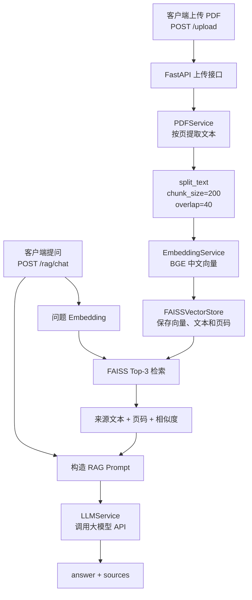

# Day 26：更新 README 并画出真实 RAG 架构图

Day 25 已经提交了 `Dockerfile` 和 `.dockerignore`，项目代码也已完成 PDF 上传、Chunk、Embedding、FAISS 检索、RAG 回答、来源页码与相似度，以及第一轮评估。现在最明显的问题不是功能缺失，而是 `README.md` 仍停留在 Day 13：它还写着 PDF、Embedding、FAISS 和 Docker 尚未开始，已经不能代表当前项目。

今天只围绕项目说明展开：根据真实代码重写 README，补上一张 Mermaid 架构图，并把接口、运行方法、评估结果和已知限制写清楚。完成后，即使面试官暂时不读源码，也能从 README 看懂这个项目解决什么问题、怎样运行、RAG 链路怎样工作，以及你为什么保留 Top-3。

---

# 一、先确认 README 应该描述哪些真实事实

打开项目：

```powershell
cd D:\my_develop\A_work_program\AI-study-2608\260804_mini-rag-backend
code .
```

先查看工作区和最近提交：

```powershell
git status --short
git log -3 --oneline
```

当前工作区应当没有未提交改动，最近两个功能节点是：

```text
Day 24：RAG 来源返回文本、页码和相似度
Day 25：新增 Dockerfile 和 .dockerignore
```

再从代码中列出真实路由：

```powershell
Select-String `
    -Path app\main.py `
    -Pattern '^@app\.(get|post)'
```

当前实际存在七个业务或练习接口：

```text
GET  /
GET  /health
POST /chat
GET  /history
GET  /request-info
POST /upload
POST /rag/chat
```

最后查看 Docker 文件：

```powershell
Get-Content Dockerfile
Get-Content .dockerignore
```

这里要区分“代码已经提供 Dockerfile”和“当前终端能够运行 Docker”。Day 25 的文件和 Git 提交已经存在，但当前 Codex 终端仍无法识别 `docker` 命令。因此 README 可以准确写：

```text
项目提供 Dockerfile 和容器启动命令
```

只有当你在自己的 PowerShell 中重新执行下面的命令成功时，才写“已完成容器运行验证”：

```powershell
docker --version
docker image ls mini-rag-backend
```

README 是对外说明，不是愿望清单。代码已经存在的功能写成“已实现”，还没验证或当前明确存在限制的内容要如实说明。

---

# 二、理解 README 和架构图分别解决什么问题

README 可以先理解成项目的入口页面。读者通常会依次关心：

```text
这是做什么的？
实现了哪些功能？
整体链路是什么？
如何在本地或 Docker 中运行？
接口怎样调用？
效果如何验证？
现在还有哪些限制？
```

当前 README 的问题不只是进度数字过期。它把已经完成的 RAG 功能仍写在“计划使用”和“后续计划”中，读者会误以为项目只有普通聊天接口。

今天重写时遵循两个原则：

```text
先写项目能力，再写学习背景
先写当前事实，再写未来优化
```

架构图则用来回答：

> 一份 PDF 和一个用户问题，分别经过哪些组件，最后怎样形成回答与来源？

它不需要画出每个 Python 函数。只保留能帮助理解主链路的组件：

```text
FastAPI
PDFService
Chunk
EmbeddingService
FAISSVectorStore
RAG Prompt
LLMService
回答与来源
```

今天使用 Mermaid，是因为它可以直接写在 Markdown 中，GitHub 能渲染，修改时也不需要重新导出图片。

---

# 三、先确定 README 的新结构

打开：

```text
README.md
```

今天把内容整理为下面的顺序：

```text
1. 项目标题与一句话介绍
2. 当前状态与核心功能
3. RAG 架构图
4. 技术栈
5. API 接口
6. 本地运行
7. Docker 运行
8. RAG 调用示例
9. 评估结果
10. 项目结构
11. 关键设计选择
12. 已知限制
13. 后续优化
```

可以删除或大幅压缩当前 README 中这些已经过时的内容：

```text
“截至 Day 13”
“第 3 周未开始”
“尚未实现 PDF 上传、Chunk、Embedding 和 FAISS”
“尚未形成完整 RAG”
“Docker 目前尚未开始”
“下一步先学习 Embedding”
```

`30 天路线` 可以保留为很短的学习背景，但不要让它占据 README 的主体。现在项目已经可以展示，README 的重点应该从“以后准备做什么”转为“现在已经做成什么”。

---

# 四、重写标题、简介和核心功能

README 开头可以改成：

```markdown
# Mini RAG Backend

一个基于 FastAPI、中文 Embedding、FAISS 和 LLM API 的纯文本科研 PDF RAG 后端。

项目支持上传文本型 PDF，按页提取并切分文本，建立内存向量索引；用户提问后，系统检索 Top-3 文本块，让大模型根据检索资料回答，并返回来源文本、PDF 页码和相似度。

**当前进度：Day 26/30**

**当前状态：最小 RAG 主链路、评估和 Dockerfile 已完成，正在进行项目包装与面试准备。**
```

接着增加“核心功能”：

```markdown
## 核心功能

- 使用 FastAPI 提供普通聊天、历史记录、PDF 上传和 RAG 问答接口。
- 使用 Pydantic 校验请求与响应数据。
- 使用 `httpx.AsyncClient` 异步调用 LLM API，并处理超时、连接失败、上游状态码和响应格式异常。
- 使用 SQLite 保存普通 `/chat` 的用户消息和模型回复。
- 使用 `pypdf` 按页提取文本型 PDF 的内容。
- 使用带 overlap 的字符切块保留相邻文本上下文。
- 使用 `BAAI/bge-small-zh-v1.5` 生成 512 维归一化中文向量。
- 使用 FAISS `IndexFlatIP` 完成 Top-3 向量检索。
- 让 `/rag/chat` 返回回答以及来源文本、PDF 页码和相似度。
- 使用 12 道固定问题建立基线，并比较 Top-1 与 Top-3 的检索效果。
- 提供 Dockerfile，用于构建并运行 FastAPI 应用镜像。
```

这里不要写成：

```text
支持任意 PDF
检索准确率达到 100%
能够彻底消除幻觉
已经达到生产环境标准
```

当前只支持带文字层的 PDF，评估也只基于一个三页测试文档和 12 道人工评分问题。README 中的措辞要保留这个范围。

---

# 五、在 README 中加入真实架构图

在核心功能后新增：

````markdown
## RAG 架构与数据流


````

这张图包含两段流程。

上传阶段：

```text
PDF
→ 按页提取文字
→ 字符切块
→ 文档 Embedding
→ 写入 FAISS，并保留页码元数据
```

提问阶段：

```text
问题
→ 问题 Embedding
→ FAISS Top-3
→ 参考资料
→ RAG Prompt
→ 大模型
→ 回答与来源
```

图中不要画数据库连接到 `/rag/chat`。当前 SQLite 只保存普通 `/chat` 的历史，RAG 问答没有写入 `messages` 表。架构图必须反映真实代码，而不是看起来更完整的假想架构。

在 VS Code 中打开 Markdown 预览，检查 Mermaid 能否正常显示：

```text
Ctrl + Shift + V
```

如果本地 Markdown 预览插件不支持 Mermaid，可以先检查代码块是否准确使用：

```text
```mermaid
```

提交到 GitHub 后再查看仓库首页渲染效果。今天不要为了画图另外安装复杂制图软件。

---

# 六、更新技术栈和 API 接口

当前“计划使用”中的 PDF、Embedding、FAISS 和 Docker 都已经进入项目，应移动到实际技术栈。

技术栈建议按职责写成：

```markdown
## 技术栈

- **Python 3.11**：项目开发语言与运行环境。
- **FastAPI + Uvicorn**：HTTP API、请求处理和接口文档。
- **Pydantic**：请求、响应和消息模型校验。
- **HTTPX**：异步调用大模型 API。
- **DeepSeek API**：普通聊天和基于上下文的回答生成。
- **SQLite**：保存普通聊天历史。
- **pypdf**：按页提取文本型 PDF。
- **Sentence Transformers**：加载 `BAAI/bge-small-zh-v1.5` 中文 Embedding 模型。
- **FAISS**：使用归一化向量和 `IndexFlatIP` 完成相似度检索。
- **Docker**：提供可重复构建的 Linux 容器运行环境。
```

API 部分只保留一张表即可，不要为每个接口再做很多重复表格：

```markdown
## API 接口

| 方法 | 路径 | 作用 |
| --- | --- | --- |
| GET | `/` | 返回服务运行提示 |
| GET | `/health` | 返回服务状态和 LLM 配置是否齐全 |
| POST | `/chat` | 调用普通 LLM、保存消息并返回回答 |
| GET | `/history` | 按顺序返回 SQLite 中的普通聊天历史 |
| GET | `/request-info` | 读取可选的 `X-Client-Name` 请求头 |
| POST | `/upload` | 上传 PDF，完成解析、Chunk、Embedding 和 FAISS 建库 |
| POST | `/rag/chat` | 针对最近上传的 PDF 检索并回答，返回来源元数据 |
```

接口表之后补一句当前状态：

```markdown
当前只维护最近一次成功上传的 PDF 索引；服务刚启动或重启后，需要先调用 `/upload`，再调用 `/rag/chat`。
```

---

# 七、写清本地运行和 Docker 运行

## 1. 本地运行

README 中保留下面的基础命令：

```powershell
git clone https://github.com/lv-xiaoke/260804_mini-rag-backend.git
cd 260804_mini-rag-backend

python -m venv .venv
.\.venv\Scripts\Activate.ps1
python -m pip install -r requirements.txt
```

然后说明在项目根目录创建 `.env`：

```env
LLM_API_KEY=
LLM_BASE_URL=
LLM_MODEL=
```

这里只能放空白模板，不能把本机真实配置复制进 README。

启动：

```powershell
python -m uvicorn app.main:app --reload
```

访问：

```text
Swagger：http://127.0.0.1:8000/docs
健康检查：http://127.0.0.1:8000/health
```

补充说明：应用导入时会加载本地 Embedding 模型，第一次启动可能需要下载模型并等待一段时间。

## 2. Docker 运行

README 中可以准确写出项目提供的容器命令：

```powershell
docker build -t mini-rag-backend .

docker run `
    --rm `
    -p 127.0.0.1:8000:8000 `
    --env-file .env `
    mini-rag-backend
```

再说明：

```markdown
`.env` 通过 `--env-file` 在容器运行时注入，不会被复制进镜像。当前没有配置 volume，容器删除后，容器内的 SQLite 数据、模型缓存和内存 FAISS 索引不会保留。
```

如果你今天执行 `docker --version` 仍然失败，README 仍可保留“项目提供 Dockerfile 和使用命令”，但不要增加“已经在当前机器验证通过”的句子。把未完成的环境验证写入 Day26 的“遇到的卡点”，以后安装 Docker Desktop 后再补实测记录。

---

# 八、加入可以直接理解的 RAG 调用示例

README 中至少提供“先上传、再提问”这两个示例。

## 1. 上传 PDF

```powershell
curl.exe `
    -X POST `
    -F "file=@data/documents/sample.pdf;type=application/pdf" `
    "http://127.0.0.1:8000/upload"
```

响应结构：

```json
{
  "filename": "sample.pdf",
  "page_count": 3,
  "chunk_count": 10
}
```

`chunk_count` 是示意值，实际结果取决于 PDF 提取文本和切块数量。

## 2. 针对 PDF 提问

请求体：

```json
{
  "question": "什么是 RAG，基础流程包括哪些步骤？"
}
```

响应结构：

```json
{
  "answer": "根据文档，RAG 会先检索相关资料，再将上下文交给大模型生成回答。",
  "sources": [
    {
      "text": "检索到的 PDF 原文片段",
      "page": 2,
      "score": 0.664656
    }
  ]
}
```

示例中的 `answer`、`text` 和 `score` 只用于展示 JSON 结构，不要把它们描述成每次请求都固定返回的结果。

还要解释三个来源字段：

```text
text：检索到的原始 Chunk
page：Chunk 来自 PDF 的物理页码
score：归一化向量的内积相似度，用于排序，不是回答正确概率
```

---

# 九、把评估结果写进 README

当前评估文件已经提供可以公开说明的数据：

```text
问题总数：12
可回答题：10
无答案题：2
基线 Top-3 检索命中：10/10（只统计可回答题）
最终回答人工判断正确：12/12
Top-1 检索命中：9/10
Top-3 检索命中：10/10
受 Top-3 帮助的题目：summary-02
```

README 中可以写成：

```markdown
## RAG 评估

项目针对三页本地测试 PDF 设计了 12 道固定问题，包括 6 道直接事实题、2 道总结题、2 道对比题和 2 道无答案题。

- 在 `chunk_size=200`、`overlap=40`、`top_k=3` 的基线中，10 道可回答题的检索均命中所需资料，12 道题的最终回答均通过人工检查。
- 保持切块参数不变时，Top-1 命中 9/10，Top-3 命中 10/10。
- `summary-02` 需要额外 Chunk 才能覆盖 Embedding、检索和生成等多个步骤，因此当前接口继续使用 Top-3。

这些结果只代表当前小型测试 PDF 和人工设计问题集，不是通用准确率，也不能证明系统在长论文和复杂版面上具有相同效果。
```

最后可以链接仓库中的评估资料：

```markdown
- 固定问题集：`data/evaluation/questions.json`
- 基线结果：`data/evaluation/baseline_results.json`
- Top-k 对照结果：`data/evaluation/top_k_comparison.json`
- 运行脚本：`scripts/run_evaluation.py`
- 检索对比脚本：`scripts/compare_top_k.py`
```

这里不要只写“准确率 100%”。分母、测试文档范围和人工评分方式必须一起写清楚，否则数字很容易造成误导。

---

# 十、更新项目结构

README 的目录树至少应反映当前核心文件：

```text
mini-rag-backend/
├── app/
│   ├── config.py
│   ├── database.py
│   ├── main.py
│   ├── models.py
│   └── services/
│       ├── chunk_service.py
│       ├── embedding_service.py
│       ├── llm_service.py
│       ├── pdf_service.py
│       ├── rag_service.py
│       └── vector_store.py
├── data/
│   └── evaluation/
│       ├── questions.json
│       ├── baseline_results.json
│       └── top_k_comparison.json
├── scripts/
│   ├── run_evaluation.py
│   └── compare_top_k.py
├── docs/
│   ├── Day1.md ～ Day26.md
│   ├── 月计划.md
│   └── 定位自己.md
├── .dockerignore
├── .gitignore
├── Dockerfile
├── requirements.txt
└── README.md
```

目录树中不要写出 `.env` 的具体内容。可以补一句：

```markdown
本地 `.env`、`.venv`、`data/chat.db` 和 `data/documents/` 已被忽略，不进入 Git；测试 PDF 需要由使用者自行准备。
```

---

# 十一、写清关键设计选择和已知限制

这部分是 README 中最能体现“不是只会调用框架”的地方。

关键设计选择可以简洁写成：

```markdown
## 关键设计选择

- 当前按页提取 PDF，再使用 `chunk_size=200`、`overlap=40` 的字符切块建立基线。
- 文档向量和查询向量都进行 L2 归一化，因此 FAISS `IndexFlatIP` 的内积可以作为余弦相似度使用。
- Top-k 对照实验显示综合题会受益于额外来源，所以当前保留 `top_k=3`。
- FAISS 负责向量检索，Python 元数据列表负责保存 Chunk 文本和页码；二者依靠相同写入顺序建立对应关系。
- RAG Prompt 要求资料中没有答案时明确说明不知道，接口同时返回来源，便于人工核对幻觉。
```

已知限制要与代码一致：

```markdown
## 已知限制

- 只支持带文字层的 PDF，不支持扫描件 OCR、图片、复杂表格和多模态内容。
- 只保留最近一次上传文档的内存 FAISS 索引，不支持多文档 ID、用户隔离和索引持久化。
- 服务重启后需要重新上传 PDF。
- 普通 `/chat` 会写入 SQLite，RAG 问答目前不保存到聊天历史。
- Embedding 模型在应用启动时加载，首次运行可能需要下载模型，启动时间和内存占用较大。
- 当前评估只覆盖一个三页测试 PDF、12 道人工设计问题和人工评分，不能代表真实长论文上的通用效果。
- 尚未建立完整的自动化单元测试、身份认证、限流和生产部署配置。
```

后续优化保持克制，只写与当前限制直接相关的内容：

```markdown
## 后续优化

- 为文档和向量索引增加持久化与多文档管理。
- 根据更长的真实论文继续评估 Chunk、overlap 和 Top-k。
- 增加关键服务与接口的自动化测试。
- 优化 Embedding 模型加载和容器内模型缓存。
- 补充认证、日志、资源限制和正式部署配置。
```

今天不要在 README 中突然宣布要加入 Qdrant、BM25、Reranker、LangGraph、Multi-Agent、MCP 或 Kubernetes。本月主线是把已经完成的最小 RAG 项目讲清楚。

---

# 十二、检查 README 是否与代码一致

保存 README 后，先搜索旧描述：

```powershell
Select-String `
    -Path README.md `
    -Pattern "Day 13|截至 Day 13|尚未实现 PDF|尚未形成完整 RAG|Docker.*尚未开始|下一步.*Embedding|第 3 周.*未开始"
```

预期不应该匹配到任何仍在描述“当前状态”的旧句子。

再确认新功能已经出现：

```powershell
Select-String `
    -Path README.md `
    -Pattern "/upload|/rag/chat|BAAI/bge-small-zh-v1.5|IndexFlatIP|Top-1|Top-3|Dockerfile|mermaid"
```

预期能找到对应的接口、模型、评估和架构图说明。

然后做四项人工核对：

```text
1. 接口表是否与 app/main.py 的七个路由一致
2. RAG 响应是否返回 text、page、score，而不是旧的字符串数组
3. 架构图是否只画了真实存在的组件和数据流
4. 已知限制是否没有把尚未完成的功能写成已实现
```

检查 Markdown 和空白错误：

```powershell
git diff --check
git diff -- README.md
```

`git diff --check` 没有输出表示没有发现常见的行尾空格等问题。再用 Markdown 预览从头阅读一次，重点看：标题层级、代码块是否闭合、Mermaid 是否完整、表格是否正常渲染。

---

# 十三、测试成功后提交 Git

查看今天的文件范围：

```powershell
git status --short
```

正常应当只有：

```text
README.md
docs/Day26.md
```

确认今天没有修改：

```text
app 中的业务代码
requirements.txt
Dockerfile
评估 JSON
.env
本地 PDF 和数据库
```

添加文件：

```powershell
git add README.md docs/Day26.md
git diff --cached --stat
git status
```

确认暂存区正确后提交：

```powershell
git commit -m "docs: refresh README and add RAG architecture"
```

最后查看：

```powershell
git log -1 --oneline
git status --short
```

提交后尝试不看源码，用 README 和架构图讲两分钟：项目解决什么问题，上传和提问分别经过哪些组件，为什么选择 Top-3，来源页码和相似度有什么作用，以及当前系统最明显的三个限制是什么。

---

# Day 26 完成标准

- [ ] 能解释 README 和架构图分别帮助读者理解什么
- [ ] 已把 README 的当前进度从 Day 13 更新到 Day 26
- [ ] README 已准确说明 PDF、Chunk、Embedding、FAISS、RAG、评估和 Dockerfile 均已进入项目
- [ ] 已加入与当前代码一致的 Mermaid RAG 架构图
- [ ] 能讲清上传阶段和提问阶段的两条数据流
- [ ] 技术栈已包含 pypdf、BGE Embedding、FAISS、SQLite、LLM API 和 Docker
- [ ] API 表与 `app/main.py` 中的七个路由一致
- [ ] 已写出本地运行、环境变量模板和 Docker 运行命令
- [ ] README 没有包含真实 API Key、Token、`.env` 内容或本地隐私数据
- [ ] 已给出 `/upload` 和 `/rag/chat` 的请求、响应示例
- [ ] 已写明 12 道问题的基线结果和 Top-1/Top-3 对照结论
- [ ] 能解释为什么当前保留 Top-3，同时说明评估结果的适用范围
- [ ] 项目结构已经更新到当前真实文件
- [ ] 已写清关键设计选择、已知限制和克制的后续优化方向
- [ ] 已删除或改正 Day 13、RAG 尚未开始、Docker 尚未开始等过时描述
- [ ] 已用 Markdown 预览检查标题、表格、代码块和 Mermaid 图
- [ ] `git diff --check` 没有发现格式问题
- [ ] 已确认今天没有修改业务代码、依赖或评估数据
- [ ] 测试成功后完成 Git 提交，并确认工作区干净

实际完成：已完成

遇到的卡点：暂无

Git commit：已提交
