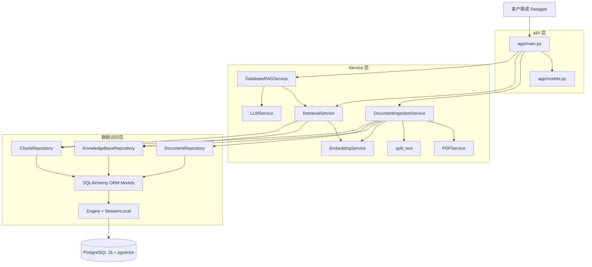
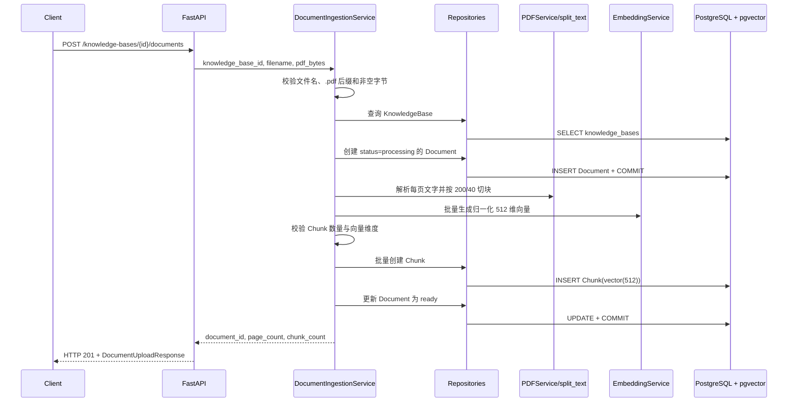
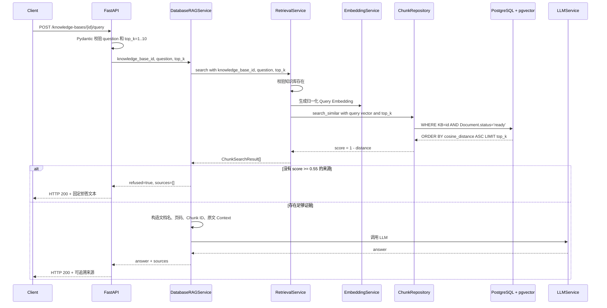
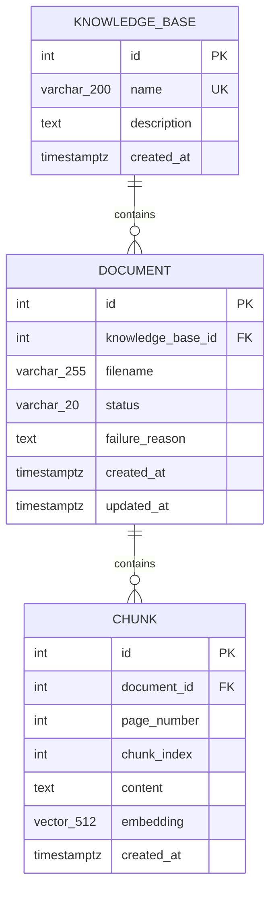

# Enterprise RAG Platform 系统架构

本文只描述当前仓库已经存在的 PostgreSQL + pgvector 企业知识库链路；旧 SQLite 普通聊天和单 PDF FAISS 接口作为兼容/演进对照保留，不属于本架构主线。

## 1. 目标与边界

当前系统解决两个核心问题：

```text
文档入库：企业文本型 PDF 怎样成为可持久化、可检索、可追溯的数据？
知识库问答：用户问题怎样只在指定知识库的 ready 文档内找到证据并生成回答？
```

当前不包含 OCR、复杂表格、多模态、异步任务、认证授权、管理前端、ANN 向量索引和生产监控。

## 2. 分层组件图



| 层 | 当前文件 | 责任 | 不负责 |
| --- | --- | --- | --- |
| API | `app/main.py`、`app/models.py` | HTTP、依赖注入、Pydantic 校验、状态码与安全错误映射 | SQL 查询、PDF 细节、向量计算 |
| Service | `app/services/` | 入库编排、检索编排、阈值拒答、Prompt 和 LLM 调用 | 持久化 SQL 细节 |
| Repository | `app/repositories/` | create/get/list/update、批量 Chunk 写入、范围过滤的 pgvector 查询 | HTTP 状态码、跨步骤业务流程 |
| ORM/Session | `app/orm_models.py`、`app/db.py` | 表映射、约束、关系、Engine、连接池、请求 Session | 数据库版本历史 |
| Migration | `migrations/versions/` | vector 扩展与三张业务表的 upgrade/downgrade | 请求期 CRUD |
| Database | PostgreSQL + pgvector | 关系数据、原文、页码、状态、向量和余弦距离计算 | PDF 解析和 LLM 生成 |

## 3. 文档入库时序



### 入库事务边界

当前实现故意保留两个阶段：

1. 创建 `processing` Document 后立即提交，使处理过程拥有稳定 ID 和可观察状态。
2. Chunk 批量写入与 `ready` 状态更新在同一后续事务中提交。

如果 PDF、Embedding、维度校验或数据库写入失败：

```text
回滚尚未提交的 Chunk 和 ready 更新
→ 把已有 Document 更新为 failed
→ 只保存安全 failure_reason
→ failed 文档被检索 SQL 排除
```

在文件名、扩展名或空字节的前置校验阶段失败时，不创建 Document 记录。

## 4. 知识库问答时序



### 检索边界

`ChunkRepository.search_similar()` 在 SQL 层同时执行：

```text
KnowledgeBase.id == 请求知识库 ID
AND Document.status == 'ready'
ORDER BY Chunk.embedding.cosine_distance(query_vector)
LIMIT top_k
```

这保证应用不会先全库检索再在 Python 中过滤，也不会让 processing/failed 文档进入 Context。

## 5. 数据关系



关键数据库规则：

- 知识库名称唯一：`uq_knowledge_bases_name`。
- 文档状态受 `ck_documents_status` 限制。
- `knowledge_base_id + status` 有组合索引，服务于知识库内状态查询。
- 页码必须大于等于 1，Chunk 顺序必须大于等于 0。
- 同一文档内 `chunk_index` 唯一。
- KnowledgeBase 删除时级联 Document，Document 删除时级联 Chunk。
- 向量列固定为 `vector(512)`，必须与当前 Embedding 模型输出一致。

## 6. 错误与安全响应

| 场景 | 当前行为 | 数据边界 |
| --- | --- | --- |
| 空知识库名称 | HTTP 400 | 不写入数据库 |
| 知识库名称冲突 | HTTP 409 | rollback 当前 Session |
| 知识库或文档不存在 | HTTP 404 | 不伪造空对象 |
| 非 PDF、空文件、无文本 PDF | HTTP 400 | 前置失败不建记录；处理中失败则安全标记 failed |
| Embedding 或处理内部错误 | HTTP 500 `文档处理失败` | 不向客户端公开内部异常，半成品 Chunk 回滚 |
| 数据库不可用 | HTTP 503 固定文本 | 不回显数据库 URL、用户名、密码或驱动堆栈 |
| question 空白或 top_k 越界 | Pydantic 422 或 Service 400 | 不执行检索 |
| 证据低于阈值 | HTTP 200、`refused=true` | 不调用 LLM，来源为空 |
| LLM 配置缺失 | HTTP 503 固定文本 | 不回显 API Key |
| LLM 上游失败 | HTTP 502 固定文本 | 不返回内部异常对象 |

## 7. 迁移与运行时依赖

```text
Docker Compose
├── postgres：pgvector/pgvector:pg16，postgres_data Volume
├── migrate：复用 API 镜像，执行 alembic upgrade head 后退出
└── api：等待 migrate 成功，加载 Embedding，提供 /health
```

迁移链：

```text
751357b5d274：CREATE EXTENSION IF NOT EXISTS vector
→ e780fe92751b：创建 knowledge_bases、documents、chunks、约束和索引
```

`api` 和 `migrate` 复用同一个 `enterprise-rag-api:local` 镜像，避免迁移脚本与运行代码使用不同依赖。`postgres_data` 保存数据库数据，`huggingface_cache` 保存模型缓存；停止或重启 API 不会把知识库退回内存状态。

## 8. 当前实现限制

- `PDFService` 只调用 pypdf 文本提取，不支持 OCR 和复杂版面恢复。
- 上传是同步请求，没有 Celery、消息队列或后台任务状态机。
- `EmbeddingService` 在 `app.main` 导入时创建，首次启动成本较高。
- 当前检索是精确余弦距离排序，没有 HNSW/IVFFlat ANN 索引。
- 当前没有认证授权；知识库过滤是数据范围规则，不是租户权限系统。
- 当前生产拒答阈值为 `0.55`；离线报告推荐 `0.65`，尚未完成参数同步与回归。
- 旧 SQLite/FAISS 路由仍与新架构共存，便于展示演进，但增加了 `app/main.py` 的职责数量。

## 9. 代码证据索引

- API 与 HTTP 错误映射：[`app/main.py`](../app/main.py)
- Pydantic 请求/响应：[`app/models.py`](../app/models.py)
- ORM 与约束：[`app/orm_models.py`](../app/orm_models.py)
- Engine 与 Session：[`app/db.py`](../app/db.py)
- 文档入库：[`app/services/document_ingestion_service.py`](../app/services/document_ingestion_service.py)
- 检索编排：[`app/services/retrieval_service.py`](../app/services/retrieval_service.py)
- pgvector SQL：[`app/repositories/chunk_repository.py`](../app/repositories/chunk_repository.py)
- 阈值拒答与来源：[`app/services/database_rag_service.py`](../app/services/database_rag_service.py)
- 迁移：[`migrations/versions/`](../migrations/versions/)
- Docker 编排：[`docker-compose.yml`](../docker-compose.yml)
- 自动测试：[`tests/`](../tests/)