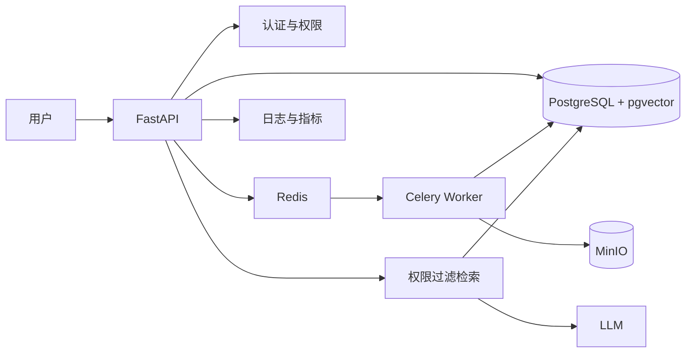

# 第二月 Day 1：建立真实基线

> 来源计划：`docs/第二月每日实施参考.md` Day 1
> 预计用时：2～3 小时
> 今日状态：已完成
> 唯一产物：`docs/第二月基线与目标架构.md`

[[第二月基线与目标架构]]

今天只做盘点、运行验证和文档记录：不改业务代码，不安装 PostgreSQL、Redis、Celery、MinIO，不覆盖历史评测结果。

## 先记住 4 件事

- **基线**：改造前可复查的代码事实和运行结果。
- **当前 RAG 状态在内存中**：服务重启后 FAISS 索引会丢失。
- **SQLite 不等于 RAG 已持久化**：它目前只保存普通聊天记录。
- **证据要分开**：代码事实、仓库历史记录、今日运行结果、目标设计不能混写。

## 步骤 1：检查起点

在项目根目录运行：

```powershell
git status --short
Test-Path .\.venv\Scripts\python.exe
Test-Path .\data\documents\sample.pdf
Test-Path .\tests
rg -n "rag_service|FAISSVectorStore|init_database|CHUNK_SIZE|CHUNK_OVERLAP|TOP_K" app
rg -n "@app\.(get|post)" app\main.py
```

只记录已有 Git 改动，不恢复、不清理、不提交。不要打开或打印 `.env`。

从代码确认下面两条链路：

```text
上传：PDF → 解析 → 切块 → Embedding → 新建内存 FAISS → 替换全局 rag_service
问答：问题 → Embedding → FAISS Top-3 → 上下文 → LLM → answer + sources
```

把结果写入 `docs/第二月基线与目标架构.md`：

| 部分    | 当前实现               | 重启后      | 月底目标             |
| ----- | ------------------ | -------- | ---------------- |
| 普通聊天  | SQLite             | 保留       | PostgreSQL 业务模型  |
| 文档处理  | 上传请求内同步完成          | 处理结果不保留  | Celery 异步任务      |
| 检索    | 最近一份 PDF 的内存 FAISS | 索引丢失     | pgvector 多知识库持久化 |
| 权限与版本 | 暂无                 | 不适用      | 权限过滤、有效版本        |
| 回答    | LLM + Top-3 来源     | 无 RAG 可用 | 可追溯引用与拒答         |
|       |                    |          |                  |

## 步骤 2：运行最小基线

### 2.1 启动服务

终端 A：

```powershell
.\.venv\Scripts\python.exe -m uvicorn app.main:app --reload
```

### 2.2 检查健康状态

终端 B：

```powershell
Invoke-RestMethod -Uri "http://127.0.0.1:8000/health"
```

记录 `status` 和 `llm_configured`，不要读取密钥。

### 2.3 验证未上传时的失败路径

```powershell
$body = @{ question = "当前执行的制度版本是什么？" } | ConvertTo-Json
$response = Invoke-WebRequest `
    -Uri "http://127.0.0.1:8000/rag/chat" `
    -Method Post `
    -ContentType "application/json; charset=utf-8" `
    -Body ([System.Text.Encoding]::UTF8.GetBytes($body)) `
    
$response.StatusCode
$response.Content
```

预期：HTTP 400，并提示先上传 PDF。记录实际结果，不要只抄预期。

### 2.4 有测试 PDF 时验证正常路径

测试 PDF 必须是自己有权使用、含文字层且不含敏感信息的文件。

```powershell
curl.exe -X POST `
    -F "file=@data/documents/sample.pdf;type=application/pdf" `
    "http://127.0.0.1:8000/upload"
```

记录 `filename`、`page_count` 和 `chunk_count`。然后提出一个能从 PDF 原文直接回答的问题：

```powershell
$body = @{ question = "请根据文档概括其中的一条明确规则。" } | ConvertTo-Json
Invoke-RestMethod `
    -Uri "http://127.0.0.1:8000/rag/chat" `
    -Method Post `
    -ContentType "application/json; charset=utf-8" `
    -Body ([System.Text.Encoding]::UTF8.GetBytes($body))
```

检查：回答是否有原文依据，`sources` 是否包含 `text`、`page`、`score`。

### 2.5 验证重启后索引丢失

1. 在终端 A 按 `Ctrl+C`。
2. 重新启动服务。
3. 再次发送 `/rag/chat` 请求。

预期再次得到 HTTP 400。这是“FAISS 未持久化”的运行证据。

如果没有测试 PDF，只完成健康检查和未上传失败路径；把上传、问答、重启验证标为“待验证”，不要写成已通过。

## 步骤 3：记录历史评测边界

在基线文档中注明：

- 仓库历史题集共 12 题，参数为 `chunk_size=200`、`overlap=40`、`top_k=3`。
- 10 道可回答题的历史记录是 Top-1 命中 9/10、Top-3 命中 10/10。
- 这些结果来自单份小型 PDF 和人工题集，只能称为“仓库历史记录”，不能称为今日复现或通用准确率。

## 步骤 4：写目标架构和差距

在基线文档加入：



列出 6 项“当前 → 月底”的差距，并各写一句可观察的验收结果：

1. 单文档内存索引 → 多知识库持久化。
2. 同步上传处理 → 异步任务和状态查询。
3. 无版本管理 → 仅检索有效版本。
4. 无权限控制 → 按组织、部门、角色过滤。
5. 来源能力有限 → 可追溯引用和无依据拒答。
6. 历史人工记录 → 固定评测集和可复现部署。

## 步骤 5：整理最终文档

`docs/第二月基线与目标架构.md` 保留以下 6 个小节即可：

1. 当前能力表。
2. 当前上传与问答链路。
3. 今日运行证据。
4. 仓库历史记录及适用边界。
5. 目标架构图与组件职责。
6. 当前到月底的差距和待验证项。

每条结论标注为以下一种：`代码事实`、`历史记录`、`今日运行`、`目标设计`。

## 常见问题

- 服务无法连接：先看 Uvicorn 是否仍在运行、端口是否占用。
- 启动停在模型加载：确认是否首次加载 Embedding 以及网络或缓存状态。
- 上传失败：检查路径、文件非空、扩展名和 PDF 是否含可复制文字。
- 问答返回 400：确认当前进程是否成功上传过 PDF。
- 问答返回 502：看 `/health` 和脱敏后的服务日志，不要粘贴 `.env`。

## 验收清单

- [x] 已创建 `docs/第二月基线与目标架构.md`。
- [x] 已记录 `/health` 和未上传问答的真实结果。
- [x] 有测试 PDF 时，已验证上传、问答、来源和重启；没有时已标为待验证。
- [x] 已区分代码事实、历史记录、今日运行和目标设计。
- [x] 已画出目标架构，并写清 6 项差距的验收结果。
- [x] 最终只修改预期文档，没有读取秘密或清理已有 Git 改动。

## 今日学习记录

```text
实际完成：已完成
Git commits：已提交
```

完成后，Day 2 将以“向量无法跨重启保留”的基线证据开始搭建 PostgreSQL + pgvector 环境。
