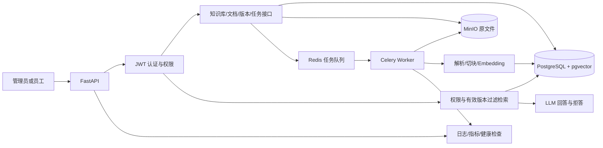

# 第二月基线与目标架构

> 更新日期：2026-08-28
> 当前状态：静态盘点已完成，API 运行验证待完成

本文使用四种证据标签：

- `代码事实`：直接来自当前代码。
- `历史记录`：来自仓库已有评测文件，不代表本次复现。
- `今日运行`：只记录本次实际执行得到的结果。
- `目标设计`：第二月计划要实现的能力。

## 1. 当前能力表

| 部分 | 当前实现 | 证据 | 持久化与重启行为 | 主要限制 |
| --- | --- | --- | --- | --- |
| API | FastAPI，提供 `/health`、`/chat`、`/history`、`/upload`、`/rag/chat` 等接口 | `代码事实`：`app/main.py` | 路由随进程重新加载 | 没有认证、知识库和文档管理接口 |
| 普通聊天 | `/chat` 调用 LLM，用户和助手消息写入 SQLite；`/history` 返回全部消息 | `代码事实`：`app/main.py`、`app/database.py` | `data/chat.db` 存在时消息可跨进程保留 | 无用户隔离、会话 ID 和分页 |
| PDF 解析 | `pypdf` 按页提取带文字层 PDF | `代码事实`：`app/services/pdf_service.py` | 解析结果不落库 | 不支持 OCR、Word、Excel 和复杂表格 |
| 文档切块 | 按字符切块，`chunk_size=200`、`overlap=40` | `代码事实`：`app/main.py`、`app/services/chunk_service.py` | Chunk 不持久化 | 不保存标题、章节、版本和 Chunk ID |
| Embedding | `BAAI/bge-small-zh-v1.5` | `代码事实`：`app/services/embedding_service.py` | 向量不持久化 | 模型在 API 进程中加载 |
| 向量检索 | 归一化向量写入 `faiss.IndexFlatIP`，问答固定取 Top-3 | `代码事实`：`app/services/vector_store.py`、`app/main.py` | FAISS 索引只存在内存中，重启后丢失 | 只有最近一次成功上传的 PDF；无过滤和相似度阈值 |
| RAG 生成 | 检索结果拼入 Prompt 后调用 LLM；资料不足时只通过 Prompt 要求模型说明不知道 | `代码事实`：`app/services/rag_service.py` | 问答和引用不落库 | 没有程序化拒答判断和引用编号绑定 |
| 来源 | 返回 `text`、`page`、`score` | `代码事实`：`app/main.py`、`app/models.py` | 不持久化 | 缺少知识库、文档、版本和 Chunk 标识 |

## 2. 当前上传与问答链路

### 上传链路

```text
POST /upload
  → 校验 .pdf 扩展名并读取全部字节
  → pypdf 按页提取文本
  → 每页按 200 字符、40 字符重叠切块
  → BGE 生成文档向量
  → 新建内存 FAISS 索引
  → 创建新的 RAGService
  → 替换全局 rag_service
  → 返回 filename、page_count、chunk_count
```

`代码事实`：只有解析、切块、Embedding 和 FAISS 写入全部成功后，才替换全局 `rag_service`。再次成功上传会覆盖上一份文档的检索状态。

### 问答链路

```text
POST /rag/chat
  → 检查全局 rag_service 是否存在
  → 为问题生成查询向量
  → FAISS Top-3 检索
  → 将检索文本拼接为上下文
  → 调用 LLM 生成回答
  → 返回 answer 和 sources[text, page, score]
```

`代码事实`：当前请求没有知识库 ID、文档 ID、版本或用户身份，因此无法进行多知识库选择、有效版本过滤和权限过滤。

### 当前持久化边界

```text
SQLite：普通 /chat 消息                     → 持久化
PDF 原文件、Chunk、Embedding、FAISS、RAG 问答 → 不持久化
```

## 3. 今日运行证据

### 前置条件检查

| 检查项                         | 本次结果 | 说明                           |
| --------------------------- | ---- | ---------------------------- |
| `.venv/Scripts/python.exe`  | 存在   | 可以继续尝试启动现有 API               |
| `data/documents/sample.pdf` | 存在   | 上传、正常问答和重启验证目前缺少样例 PDF       |
| `tests/`                    | 不存在  | 当前没有自动化测试目录                  |
| `data/chat.db`              | 存在   | 只说明 SQLite 文件存在，不说明 RAG 已持久化 |

以上仅是 `今日运行` 的文件存在性检查，不等于 API 功能已经运行通过。

### API 验证记录

| 验证项       | 命令或动作                                                         | 当前状态 | 实际结果                                  |
| --------- | ------------------------------------------------------------- | ---- | ------------------------------------- |
| 启动 API    | `.\.venv\Scripts\python.exe -m uvicorn app.main:app --reload` | 通过   | 待填写启动结果或脱敏报错                          |
| 健康检查      | `GET /health`                                                 | 通过   | 待填写 HTTP 状态、`status`、`llm_configured` |
| 未上传就问答    | `POST /rag/chat`                                              | 通过   | 代码预期 HTTP 400、`请先上传 PDF`；尚未实测         |
| 上传 PDF    | `POST /upload`                                                | 通过   | 待填写文件名、页数、Chunk 数                     |
| 正常 RAG 问答 | 上传成功后 `POST /rag/chat`                                        | 通过   | 待填写回答及来源核对结果                          |
| 重启后再次问答   | 重启 API 后 `POST /rag/chat`                                     | 通过   | 代码预期索引丢失；尚未实测                         |

未完成的项目不得改写为“已通过”。补齐合法的带文字层测试 PDF 后，再完成上传、来源核对和重启验证。

## 4. 仓库历史记录及适用边界

`历史记录`：`data/evaluation/questions.json` 保存了 12 道题，其中 10 道可回答题、2 道无答案题；基线参数为 `chunk_size=200`、`overlap=40`、`top_k=3`。

`历史记录`：`data/evaluation/top_k_comparison.json` 记录了一次不调用 LLM 的检索对照：

| 条件 | 结果 |
| --- | --- |
| 固定参数 | `chunk_size=200`、`overlap=40` |
| 可回答问题数 | 10 |
| Top-1 检索命中 | 9/10 |
| Top-3 检索命中 | 10/10 |
| Top-3 明确帮助的题目 | `summary-02` |

适用边界：结果来自单份三页测试 PDF、小规模人工题集和人工判断，只能作为仓库历史基线，不能称为今日复现、通用准确率或生产指标。

## 5. 目标架构图与组件职责



| 组件            | 目标职责                                |
| ------------- | ----------------------------------- |
| FastAPI       | 接收上传、状态查询、管理和问答请求，不在上传请求中完成全部重处理    |
| PostgreSQL    | 保存组织、用户、知识库、文档、版本、任务状态和 Chunk 元数据   |
| pgvector      | 保存向量，并在知识库、权限、文档状态和有效版本条件内检索        |
| Redis         | 保存 Celery 队列所需的任务消息                 |
| Celery Worker | 异步执行 PDF 解析、切块、Embedding、入库、重试和重新索引 |
| MinIO         | 保存原始 PDF，使 Worker 可以重新读取并恢复处理       |
| 认证与权限         | 在数据查询和检索前执行组织、部门及角色约束               |
| 日志与指标         | 记录请求、任务、检索、模型调用、耗时和健康状态             |

### 目标数据流

`目标设计`——上传：认证与鉴权 → 保存文档/版本元数据与 MinIO 原文件 → 投递任务 → Worker 处理 → Chunk 和向量写入 PostgreSQL/pgvector → 标记版本可检索。

`目标设计`——问答：认证与鉴权 → 指定知识库 → 按组织、部门、角色和有效版本过滤 → 检索 → 无依据拒答或调用 LLM → 返回可定位到文档、版本、页码和 Chunk 的引用。

## 6. 当前到月底的差距和待验证项

| 能力      | 当前                     | 月底目标                                | 可观察验收                                       |
| ------- | ---------------------- | ----------------------------------- | ------------------------------------------- |
| 多知识库持久化 | 最近一份 PDF 的内存索引         | PostgreSQL + pgvector 保存多知识库、多文档    | 连续上传至少 10 份文档；重启后无需重新上传即可跨文档检索              |
| 异步处理    | 上传请求同步完成全部处理           | Redis + Celery，支持状态、失败重试和重新索引       | 上传立即返回文档 ID、任务 ID；状态可查询；失败可安全重试             |
| 文档版本    | 无文档与版本模型               | 保存多个版本，只检索当前有效版本                    | 停用旧版后，新回答不再引用旧版                             |
| 权限控制    | 无登录和权限过滤               | JWT、组织、部门及 `admin/editor/viewer` 角色 | 跨组织、跨部门和角色越权请求均无法检索受限内容                     |
| 引用与拒答   | 只有文本、页码、分数；拒答依赖 Prompt | 返回文档、版本、页码、Chunk 和原文；无依据时程序化拒答      | 每条来源可定位原文；无关、无权限或资料不足时不编造、不泄露               |
| 评测与部署   | 12 题历史记录，无自动化测试目录      | 30 题固定评测、自动测试、Docker Compose 和演示材料  | 可重复报告 Recall@5、引用/拒答正确率和延迟；完整环境可一键启动并连续演示两次 |
|         |                        |                                     |                                             |

### Day 1 待完成

- [x] 实际启动 API 并记录结果。
- [x] 记录 `/health` 的真实响应。
- [x] 实测未上传时 `/rag/chat` 的 HTTP 400。
- [x] 准备合法的带文字层测试 PDF。
- [x] 完成上传、正常问答、来源核对和重启后索引丢失验证。

完成这些运行记录后，本文件即可作为 Day 2 建立 PostgreSQL + pgvector 环境时的改造前基线。
