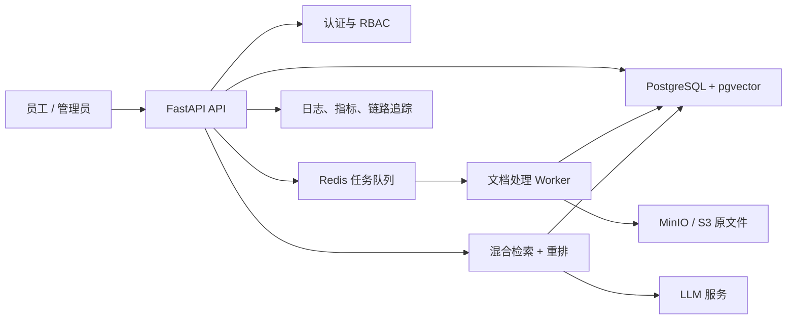

我最推荐你把它升级成：

# 企业制度 / SOP 智能知识库

它不是泛泛的“上传 PDF 聊天”，而是解决企业员工实际问题：

- “出差住宿报销标准是多少？”
- “生产设备出现 E103 故障怎么处理？”
- “新员工转正需要哪些材料？”
- “这个客户问题应该参考哪份售后手册？”
- “当前执行的是哪个版本的制度？”

回答必须给出文档名称、版本、页码和原文引用；没有依据时明确拒答。

这条路线非常适合你，因为现有 PDF 解析、Embedding、FAISS 检索、LLM 生成和来源引用几乎都能复用。

## 你当前项目的定位

目前属于一个完成度不错的“单机 RAG 技术 Demo”，但还不能给企业使用，主要差距是：

- `rag_service` 是全局变量，只能服务最近上传的一份 PDF。
- FAISS 索引存在内存中，服务重启后数据消失。
- 所有用户共享聊天记录，没有用户、企业和权限概念。
- SQLite 不适合多实例部署。
- 上传文件没有大小限制、内容校验和异步处理。
- Embedding 和 PDF 解析直接在接口中执行，容易阻塞请求。
- 没有文档版本、删除、重新索引和处理状态。
- 没有自动化测试、日志追踪、监控、限流、审计和成本统计。
- 当前评测集较小，不能证明面对企业文档时的准确性。

所以升级的核心不只是“换一个更好的向量数据库”，而是从单次问答转成完整的企业知识生命周期。

## 推荐产品形态

做成一个多租户平台，但先用一个具体行业演示。

### 管理员端

- 创建企业、部门和知识库。
- 上传 PDF、Word、Excel、网页等资料。
- 查看解析、切块、向量化进度。
- 设置文档可见部门。
- 发布、停用和更新文档版本。
- 查看高频问题、未回答问题和用户反馈。
- 查看谁在什么时间访问了哪些知识。

### 员工端

- 选择知识库进行问答。
- 支持多轮对话。
- 每个结论展示文档、页码、版本和原文。
- 对回答点赞、点踩或反馈错误。
- 无可靠资料时明确回答“知识库中没有足够依据”。
- 只能检索自己有权访问的资料。

建议使用“通用平台 + 垂直演示”模式，例如：

|方向|实际用途|难度|推荐度|
|---|---|---|---|
|企业制度与报销问答|HR、财务、行政制度查询|中|最高|
|售后客服知识助手|推荐答案、工单分类、相似案例|中高|很高|
|设备运维助手|故障码、维修手册、巡检 SOP|中高|很高|
|合同审查助手|条款提取、风险提示|高|暂不建议作为第一版|
|全自动业务 Agent|自动发邮件、改数据、下订单|很高|后期再做|

第一版建议选择“制度与 SOP”，最容易获得真实资料、设计测试问题，也最容易解释商业价值。

## 推荐架构

````

````

技术选择建议：

- FastAPI：继续使用。
- PostgreSQL + pgvector：同时保存业务数据、权限元数据和向量，第一版比维护独立向量数据库更简单。pgvector支持 HNSW、全文与向量混合检索，并专门说明了多租户隔离策略。[pgvector 官方文档](https://github.com/pgvector/pgvector)
- SQLAlchemy 2 + Alembic：ORM 和数据库迁移。
- Redis + Celery/Dramatiq：处理 PDF、OCR、Embedding 等耗时任务。
- MinIO/S3：保存原始文档。
- JWT/OIDC + RBAC：用户登录和部门权限。
- OpenTelemetry：统一记录请求、检索和模型调用的 traces、metrics、logs。[OpenTelemetry 官方文档](https://opentelemetry.io/docs/)
- pytest + GitHub Actions：自动测试和 CI。
- Docker Compose：第一阶段部署；暂时不必急着上 Kubernetes。

我反而不建议现在立刻引入很重的 Agent 框架。你现在的代码分层清楚，继续维护自己的 RAG Service 更利于理解、测试和控制。

## 分阶段升级路线

### 第一阶段：从单文档 Demo 变成可持续使用的系统

目标是“服务重启后还能用”。

- PostgreSQL 替换 SQLite。
- FAISS 替换为 pgvector。
- 增加 `users`、`organizations`、`knowledge_bases`、`documents`、`document_versions`、`chunks`。
- 每份文档拥有独立 ID 和处理状态。
- 支持多文档知识库、文档列表、删除和重新索引。
- 原始文件保存到 MinIO/S3。
- 增加 Alembic 数据库迁移。

这是最重要的一阶段。

### 第二阶段：真正具备企业权限

- 用户登录。
- 企业和部门隔离。
- `admin`、`editor`、`viewer` 三类角色。
- 每个 Chunk 继承文档权限。
- 检索时先应用企业、知识库和权限过滤，再进行相似度检索。
- 增加操作审计日志。

特别注意：不能先检索全部企业数据，再在响应阶段隐藏结果。权限必须进入检索条件。

### 第三阶段：提升 RAG 质量

- 字符切块改为基于标题、段落和 Token 的结构化切块。
- 向量检索与关键词检索结合。
- Top-N 召回后增加 Reranker。
- 增加相似度阈值和无答案判断。
- 相邻 Chunk 合并，避免上下文断裂。
- 引用精确到文档版本、页码、Chunk。
- 建立至少 100 道包含事实题、综合题、权限题和无答案题的评测集。
- 记录 Recall@K、MRR、引用正确率、拒答正确率和端到端延迟。

### 第四阶段：安全和稳定性

- 限制文件大小、页数和格式。
- 防止恶意 PDF、压缩炸弹、提示词注入。
- 敏感字段脱敏。
- API 限流、模型调用额度和超时重试。
- 后台任务幂等，失败后可以继续执行。
- 备份与恢复验证。
- 健康检查拆分为 liveness 和 readiness。

企业 RAG 必须考虑提示词注入、敏感数据泄露、向量与 Embedding 弱点、资源无限消耗等风险，这些都在 OWASP 2025 LLM 风险列表中。[OWASP GenAI Top 10](https://genai.owasp.org/llm-top-10/)

### 第五阶段：产品化

- 增加 Web 管理端。
- 流式输出回答。
- 问答历史与会话管理。
- 未解决问题看板。
- 用户反馈闭环。
- 按模型、用户和知识库统计 Token、费用和延迟。
- 一键导入企业示例数据并提供演示账号。

## 企业可用的验收标准

至少做到下面这些，才适合在简历或演示中称为“企业级”：

- 服务重启或横向扩容后，文档和索引不丢失。
- A 企业的用户绝对检索不到 B 企业的数据。
- 每条回答能追溯到明确的文档版本和页码。
- 文档更新后，旧版本可以停用且不会继续被检索。
- 无答案问题不会强行编造。
- 后台任务可以查看进度、失败原因并安全重试。
- 每次模型调用都有耗时、Token、费用和 trace ID。
- 关键接口有单元测试和集成测试。
- 数据库有迁移、备份和恢复方案。
- 有一套可以重复运行的 RAG 质量评测。

最合理的实施顺序是：

1. PostgreSQL + pgvector 持久化
2. 文档和知识库数据模型
3. 异步文档处理
4. 用户、租户和权限
5. 检索质量与评测
6. 安全、可观测性和前端

如果只选择一个近期目标，我建议先完成“多知识库 + PostgreSQL/pgvector + 文档处理任务化”。这一版完成后，你的项目就会从学习 Demo 跨入真正的产品原型阶段。

---

问：
现在有什么途径把自己的项目推销给企业吗，或者做哪些任务可以套现，我想要我的项目有一个直观的成果，方便我后期用这个项目来面试岗位

答：
有，而且最现实的路线不是直接“卖一套企业级 RAG 系统”，而是把它包装成一个范围明确、可以快速验收的小服务：

> 企业文档知识库 PoC + 飞书机器人接入 + 私有化部署

这样既容易获得第一笔收入，也能形成很强的面试案例。

## 一、最适合你的套现任务

下面的价格不是市场统一价，而是你作为初期开发者可以测试的报价起点，服务器、模型和 OCR 费用另外计算。

|可出售任务|交付内容|初期参考报价|
|---|---|---|
|RAG 效果诊断|测试集、检索命中率、问题报告、优化建议|¥800～2,000|
|企业知识库 PoC|20～100 份文档、问答、引用、Docker 部署|¥3,000～8,000|
|飞书知识库机器人|飞书内提问、引用来源、用户身份识别|¥2,000～6,000|
|文档解析服务|PDF/Word/OCR、切块、结构化输出|¥1,500～5,000|
|部门级知识库 MVP|用户权限、文档管理、问答、后台、部署|¥10,000～30,000|
|后续维护|部署维护、模型切换、故障处理|¥800～3,000/月|

第一单不要接“开发完整 AI 平台”，尽量接这种可控任务：

- 把一批产品手册做成可检索知识库。
- 给现有网站增加 AI 客服接口。
- 把企业制度接入飞书机器人。
- 优化一个现有 RAG 系统的召回率。
- 为培训机构搭建课程资料问答。
- 为售后团队制作故障手册助手。

这些任务和你现有代码重合度很高。

## 二、获得企业客户的途径

### 1. 熟人和本地企业，成功率最高

优先找：

- 学校老师、同学所在公司、校友企业。
- 本地制造业、培训机构、软件公司。
- 有大量产品手册的售后团队。
- 有大量制度文件的 HR、行政部门。
- 小型 ERP、CRM、企业数字化服务商。

不要问对方“需不需要 RAG”，而要问：

- 客服是否经常重复回答同样的问题？
- 新员工是否找不到制度和操作流程？
- 售后是否需要翻大量设备手册？
- 企业文档更新后，员工是否还在使用旧版本？

企业购买的是“减少查询和培训时间”，不是 FAISS、Embedding 或大模型。

### 2. 外包和企业服务平台

- [猪八戒网](https://www.zbj.com/)目前已经有“知识库搭建、私有化部署、大模型应用开发、AI 智能客服”等明确分类，可以发布标准化服务。
- [程序员客栈](https://support.proginn.com/outsource/coder-sign/)会根据作品、技能和经验匹配项目，但官方签约条件对缺少工作经验的开发者并不友好，建议有完整案例后再尝试。
- Upwork 可以尝试英文市场。其2026年平台数据中，AI Integration 需求增长178%，AI Chatbot Development 增长71%，但需要英文沟通和较强的作品展示。[Upwork 2026技能需求报告](https://investors.upwork.com/node/12681/pdf)

初期不要和团队竞争“完整系统开发”，重点接：

- FastAPI 接口开发。
- LLM API 接入。
- RAG 检索优化。
- PDF/OCR 文档处理。
- Docker 私有化部署。
- 飞书机器人集成。

### 3. 与软件公司合作

这是容易被忽视的一条路。

联系做 ERP、CRM、小程序、企业官网的外包公司，告诉他们：

> 你们已有客户如果提出 AI 知识库、智能客服需求，我可以作为技术合作方完成 RAG 后端、模型接入和部署。

他们有客户但未必有 AI 工程师，你有技术但缺客户，合作比独立获客更容易。

### 4. 用内容获得询盘

建议持续发布同一个案例，而不是每天换一个技术主题：

- B站：3分钟演示企业知识库。
- 知乎/掘金：从单 PDF RAG 升级到多租户知识库。
- 小红书：企业知识库实际能解决什么问题。
- GitHub/Gitee：开源基础版。
- 微信群/V2EX：寻找一家企业进行试点。

内容标题尽量讲结果，例如：

> 我把一家制造企业的80份设备手册做成了可追溯的售后助手

比“使用FastAPI和FAISS开发RAG”更容易吸引客户和面试官。

## 三、让项目产生直观成果

我建议最终做成：

### 企业知识库管理后台

- 管理员上传、更新、停用文档。
- 展示文档处理进度。
- 设置部门访问权限。
- 查看用户反馈和未解决问题。
- 展示检索命中率、调用量、延迟和费用。

### 员工问答端

- 多轮对话。
- 流式输出。
- 引用文档名称、版本和页码。
- 点击引用查看原文。
- 无依据时拒绝回答。
- 不同部门看到不同资料。

### 飞书机器人

这是非常直观的企业化证明：员工不用打开新系统，直接在飞书提问。飞书官方支持机器人、网页应用和企业自建应用，企业管理员审核后即可在组织内部使用。[飞书开放平台](https://open.feishu.cn/?lang=zh-CN)

面试现场可以这样演示：

1. 管理员上传一份新版报销制度。
2. 后台展示“解析中 → 已完成”。
3. 员工在飞书询问住宿标准。
4. 机器人回答并引用具体版本和页码。
5. 普通员工询问财务机密内容，被权限系统拦截。
6. 管理员停用旧版制度，旧内容不再被检索。

这个演示同时证明了后端、数据库、异步任务、RAG、权限和企业集成能力。

## 四、面试作品集必须包含什么

最终至少交付六项成果：

- 一个可访问的在线演示地址。
- 一个3分钟以内的演示视频。
- 一个有完整 README 的 GitHub/Gitee 仓库。
- 一张系统架构图。
- 一份真实或脱敏的案例报告。
- 一组可以复现的评测与性能数据。

案例报告建议写清楚：

- 企业原来有什么问题。
- 你设计了什么解决方案。
- 数据规模和文档类型。
- 检索效果如何评测。
- 优化前后有什么变化。
- 系统如何保障权限和数据隔离。
- 遇到了什么技术问题，如何解决。

## 五、简历上的表达方式

不要写：

> 使用FastAPI、FAISS和大模型完成RAG问答。

可以写成：

> 设计并实现多租户企业知识库平台，支持文档异步解析、版本管理、部门级RBAC、混合检索、答案引用和无答案拒答。

量化版本可以写：

> 建立包含___道问题的自动化评测集，通过混合检索与重排将Recall@5从___提升至___；在___并发下接口P95延迟为___秒。

数字必须通过真实测试获得，不要编造。

## 六、建议你接下来的四周这样安排

- 第一周：PostgreSQL + pgvector、多文档、知识库和文档数据模型。
- 第二周：异步处理、文档状态、用户登录和部门权限。
- 第三周：混合检索、Reranker、评测集和监控数据。
- 第四周：管理前端、飞书机器人、在线部署、演示视频和案例报告。

如果暂时找不到真实企业，可以先制作一个虚构但完整的“制造企业设备运维知识库”，使用公开或自行编写的非敏感资料。随后找一家真实企业做一次小额 PoC，争取获得三样东西：脱敏后的案例授权、客户评价和转介绍。第一单的最大价值往往不是收入，而是把“学习项目”变成“真实交付项目”。

