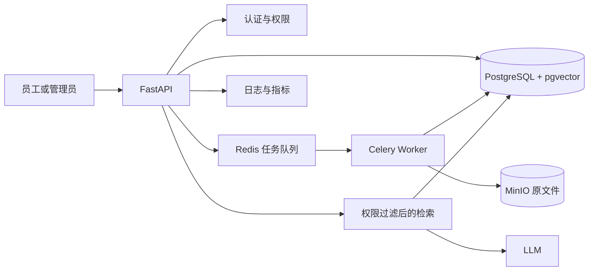

# 第二月 Day 1：确认起点和月底完成标准

> 来源计划：`docs/第二月每日实施参考.md` Day 1
> 预计用时：2～3 小时
> 今日状态：未开始

## 今天在整个项目中的位置

- **现有输入：** 仓库已经有 FastAPI 接口、SQLite 普通聊天记录、PDF 按页解析、字符切块、BGE Embedding、全局内存 FAISS 检索、LLM 生成和来源返回；还有一组 12 道题的历史评测记录。
- **今天解决的问题：** 把“README 里写了什么”“代码里实际有什么”“今天亲手运行证明了什么”分开，建立第二月所有改造都能对照的真实基线。
- **今天唯一核心成果：** 完成 `docs/第二月基线与目标架构.md`，其中包含现有接口与数据流盘点、可复现运行证据、已知限制、月底完成标准和目标架构草图。
- **明天如何使用：** Day 2 会从这份基线中读取“数据和向量重启后会丢失”的证据，开始建立 PostgreSQL + pgvector 环境。
- **今天明确不做：** 不安装 PostgreSQL、pgvector、Redis、Celery 或 MinIO；不改业务代码；不做数据库迁移；不重写现有 RAG；不清理当前 Git 改动。

```text
现有单文档 RAG → 盘点并运行取证 → 基线与目标架构文档 → Day 2 持久化环境输入
```

### 生成计划时看到的仓库事实

- `app/main.py` 在模块级创建 `llm_service`、`pdf_service`、`embedding_service`，并使用全局 `rag_service` 保存最近一次成功上传生成的索引。
- `/upload` 同步完成 PDF 解析、`chunk_size=200`/`overlap=40` 切块、Embedding 和新建 FAISS 索引；新上传会替换旧的全局 RAG 服务。
- `/rag/chat` 固定取 Top-3，返回 `text`、`page`、`score`；当前没有知识库 ID、文档 ID、版本或用户权限。
- SQLite 的 `messages` 表只服务普通 `/chat` 和 `/history`；RAG 文档、Chunk、向量与问答不写入 SQLite。
- 仓库记录了 12 道历史题目；其中 10 道可回答题的 Top-1/Top-3 检索命中记录为 9/10 和 10/10，但这些是已有文件中的历史结果，不等于今天已复现。
- 生成本计划时：`.venv` 存在；`data/documents/sample.pdf`、`data/chat.db`、`tests/` 和 Compose 文件不存在。
- Git 工作区在开始前已经不干净：有 3 个已跟踪文档显示删除，第二月提示词与实施参考是未跟踪文件。它们都是已有用户改动，今天不得恢复、删除、覆盖或顺手提交。

## 做之前先理解

### 1. 基线

- **它是什么：** 改造开始前，对系统当前能力、限制、运行结果和环境条件的一份可复查快照。
- **为什么本项目需要它：** 第二月会连续更换数据库、检索存储和处理方式；没有基线，就无法证明改造解决了什么，也无法解释指标是否真的改善。
- **它影响哪里：** 影响后续架构取舍、测试范围、演示口径和简历中的量化表述。
- **怎样证明理解：** 你能指出一条“代码事实”、一条“今天运行事实”和一条“仍待验证的历史记录”，并说明三者为什么不能混写。

### 2. 进程内状态与全局实例

- **它是什么：** `rag_service` 和 FAISS 索引只存在于当前 Python 进程的内存中；全局实例表示所有请求共享同一份对象。
- **为什么本项目需要理解它：** 当前最后一次上传会替换前一次索引，服务重启后索引消失，这正是 Day 2～Day 7 要解决的核心问题。
- **它影响哪里：** 影响多文档能力、并发用户隔离、服务重启、横向扩容和故障恢复。
- **怎样证明理解：** 成功上传后重启 API，再请求 `/rag/chat`，预期重新得到“请先上传 PDF”，并能解释原因不是 PDF 被删除，而是索引只在旧进程内存中。

### 3. 持久化

- **它是什么：** 数据写入进程结束后仍能保留的存储，例如磁盘数据库或对象存储。
- **为什么本项目需要它：** 企业制度不能因为 API 重启就要求重新上传和重新生成向量。
- **它影响哪里：** SQLite 当前只持久化普通聊天；未来 PostgreSQL/pgvector 保存业务数据和向量，MinIO 保存原文件。
- **怎样证明理解：** 你能画出当前“SQLite 持久、FAISS 不持久”的分界，并说明 PostgreSQL、pgvector 与 MinIO 后续各自保存什么。

### 4. 目标架构与组件边界

- **它是什么：** 把 API、数据库、任务队列、Worker、对象存储、检索和 LLM 的职责画清楚，而不是只罗列技术名词。
- **为什么本项目需要它：** 后续 28 天每天只改链路的一段，必须知道新组件接在哪、输入输出是什么。
- **它影响哪里：** 影响上传响应时间、任务状态、原文件恢复、权限过滤、检索持久化和运行部署。
- **怎样证明理解：** 不看主计划，用自己的话讲清“上传一份制度”和“员工提出问题”在目标架构中的两条数据流。

**常见错误：** 直接把 README 或已有 JSON 中的结果写成“今天已经验证通过”。后果是环境、依赖或代码变化后仍沿用旧结论，后续优化没有可信对照。今天必须给每条结论标注为“代码静态事实”“仓库历史记录”“今天运行证据”或“目标设计”。

## 今日时间安排

| 时间 | 安排 | 结果 |
| --- | --- | --- |
| 0～25 分钟 | 阅读本计划和关键代码，画出现有链路 | 能口述当前上传、检索、生成与存储分界 |
| 25～75 分钟 | 建立接口、数据与限制盘点表 | `docs/第二月基线与目标架构.md` 的“当前基线”初稿 |
| 75～125 分钟 | 启动 API，验证健康检查、失败路径；有安全测试 PDF 时再验证上传和问答 | 保存真实命令、状态码、响应摘要与时间 |
| 125～165 分钟 | 画目标架构和当前→月底差距矩阵 | 一个能解释组件职责的 Mermaid 草图 |
| 165～180 分钟 | 自检、填写学习记录和 Git 差异 | 验收清单有证据可勾选 |

**有余力再做：** 用 3 分钟录音讲解“为什么 SQLite 不能说明 RAG 已持久化”。不要提前开始 Day 2 的 Compose 配置。

## 开始前检查

### 1. 检查工作区，不处理已有改动

```powershell
git status --short
git log -5 --oneline --decorate
```

**目的：** 记录开始前已有改动和最近提交，避免把别人的或自己之前的改动误算为今天成果。当前预期会看到已有删除项与未跟踪的第二月文档；只记录，不执行恢复、清理、删除或提交。

### 2. 检查运行前置条件

```powershell
Test-Path .\.venv\Scripts\python.exe
Test-Path .\data\documents\sample.pdf
Test-Path .\tests
Get-ChildItem -LiteralPath . -Force | Select-Object Name,Mode,Length
```

**目的与分支：**

- `.venv` 的 Python 不存在：今天先记录“环境不可复现”，再按 README 创建环境；安装依赖不应悄悄进行。
- `sample.pdf` 不存在：这与生成计划时的事实一致。准备一份自己有权使用、含文字层且不含敏感信息的 PDF，或让 AI 生成明确标记为 `synthetic/demo` 的短文本后由你导出为 PDF。不要下载版权和许可不明的制度。
- `tests/` 不存在：记录为自动化测试缺口，不在 Day 1 临时补整套测试。
- 根目录有 `.env` 时只确认文件存在；不要打开、打印或复制其内容。通过 `/health` 的 `llm_configured` 判断模型配置是否可用。

### 3. 从代码确认链路，不只看 README

```powershell
rg -n "rag_service|FAISSVectorStore|init_database|CHUNK_SIZE|CHUNK_OVERLAP|TOP_K" app
rg -n "@app\.(get|post)" app\main.py
Get-Content -LiteralPath .\requirements.txt
```

**目的：** 找到全局状态、索引实现、SQLite 初始化、关键参数、接口与真实依赖。若 README 与代码不同，以代码和运行结果为准，并把冲突写进基线文档。

## 核心任务

### 步骤 1：[你来完成] 画清当前系统，不改代码

在 `docs/第二月基线与目标架构.md` 中先建立一张表，至少包含：

| 层 | 当前实现 | 代码证据 | 是否持久化 | 重启后行为 | 本月目标 |
| --- | --- | --- | --- | --- | --- |
| 接口层 | FastAPI | `app/main.py` | 不适用 | 路由重新加载 | 后续加入认证、知识库、状态接口 |
| 数据层 | SQLite 仅保存普通聊天 | `app/database.py` | 是 | 消息应保留 | PostgreSQL 业务模型 |
| 文档处理层 | 上传请求内同步解析、切块、Embedding | `app/main.py` | 否 | 需重新上传 | Redis + Celery Worker |
| 检索层 | 全局内存 FAISS、最近一份 PDF、Top-3 | `app/services/vector_store.py` | 否 | 索引丢失 | pgvector、多文档、有效版本与权限过滤 |
| 生成层 | 检索片段拼 Prompt 后调用 LLM | `app/services/rag_service.py` | 否 | 无历史 | 引用、拒答与可评测链路 |

然后用自己的话写出当前两条链路：

```text
上传：PDF → 按页解析 → 字符切块 → Embedding → 新建内存 FAISS → 替换全局 rag_service
问答：问题 → Embedding → FAISS Top-3 → 拼接上下文 → LLM → answer + text/page/score
```

不要复制 README 后就算完成；每一行都回到代码找到证据。

### 步骤 2：[你来完成] 运行最小基线并保存证据

**终端 A：启动服务**

```powershell
.\.venv\Scripts\python.exe -m uvicorn app.main:app --reload
```

首次启动会加载 `BAAI/bge-small-zh-v1.5`。如果模型未缓存，可能需要下载；先记录真实报错，不要无目的升级依赖。

**终端 B：健康检查**

```powershell
Invoke-RestMethod -Uri "http://127.0.0.1:8000/health"
```

记录 `status` 与 `llm_configured`。后者是公开状态，不需要查看 `.env`。

**先验证关键失败路径：未上传就问答**

```powershell
$body = @{ question = "当前执行的制度版本是什么？" } | ConvertTo-Json
$response = Invoke-WebRequest `
    -Uri "http://127.0.0.1:8000/rag/chat" `
    -Method Post `
    -ContentType "application/json; charset=utf-8" `
    -Body ([System.Text.Encoding]::UTF8.GetBytes($body)) `
    -SkipHttpErrorCheck
$response.StatusCode
$response.Content
```

**预期：** HTTP 400，内容说明“请先上传 PDF”。把状态码和响应摘要写入基线文档。

**有合法测试 PDF 后验证正常路径：**

```powershell
curl.exe `
    -X POST `
    -F "file=@data/documents/sample.pdf;type=application/pdf" `
    "http://127.0.0.1:8000/upload"
```

预期响应包含真实的 `filename`、`page_count`、`chunk_count`。随后使用与 PDF 内容直接相关的问题：

```powershell
$body = @{ question = "请根据文档概括其中的一条明确规则。" } | ConvertTo-Json
Invoke-RestMethod `
    -Uri "http://127.0.0.1:8000/rag/chat" `
    -Method Post `
    -ContentType "application/json; charset=utf-8" `
    -Body ([System.Text.Encoding]::UTF8.GetBytes($body))
```

**预期：** 在 LLM 已配置且可访问时返回 `answer`，`sources` 中每项有 `text`、`page`、`score`。问题必须根据你实际 PDF 改写；不要用与文档无关的固定问题冒充正常验证。

最后在终端 A 按 `Ctrl+C` 停止并重新启动服务，再重复 `/rag/chat` 请求。当前实现预期回到 HTTP 400，这条负向结果就是“FAISS 尚未持久化”的运行证据。

如果当天无法准备测试 PDF，仍完成健康检查与未上传失败路径，并把上传、问答、重启验证明确标记为“受前置样例阻塞”，不能写成已通过。

### 步骤 3：[你来完成] 区分历史评测与今日复现

在基线文档中记录：

- 仓库历史记录：12 道题，`chunk_size=200`、`overlap=40`、接口 `top_k=3`。
- 历史 Top-k 对照：10 道可回答题中 Top-1 命中 9 道、Top-3 命中 10 道，`summary-02` 从 Top-3 获益。
- 适用边界：单份三页测试 PDF、小规模人工题集和人工判断，不能叫通用准确率。
- 今日复现状态：只填写你今天实际运行的请求、结果和失败项。

现有评测脚本会写入 `data/evaluation/*.json`。Day 1 不需要为了“看起来完整”覆盖历史结果；先把它们当历史证据并记录缺失的 `data/documents/sample.pdf`。完整可重复评测会在后续专门的评测日完成。

### 步骤 4：[你来完成] 画目标架构并建立差距矩阵

在同一份基线文档加入下面的最小骨架，再由你逐个解释箭头：



再写 6 条最重要的“当前 → 月底”差距：多知识库持久化、异步处理、文档版本、组织/部门/角色权限、可追溯引用与拒答、固定评测和可复现部署。每条都写一个月末可观察验收，不要只列技术名词。

### 步骤 5：[AI 辅助] 审查你的理解，不代替取证

可以直接提问：

> 请只根据 `app/main.py`、`app/database.py`、`app/services/rag_service.py` 和 `app/services/vector_store.py` 审查我写的当前数据流。请逐条指出证据文件、我混淆了哪些层，以及哪些结论尚未经过运行验证。不要修改代码，不要读取 `.env`，不要把 README 描述当成运行结果。

你必须自己打开证据位置、运行命令并决定是否接受 AI 的判断。

## AI 代办与协作请求

### [AI 可直接完成] 把已验证笔记整理成基线文档初稿

**为什么适合交给 AI：** 这是基于你已经完成的代码盘点与运行记录进行结构化整理，不替代核心代码阅读、命令执行、结果判断和架构讲解。

**可以直接复制给 AI：**

> 请直接完成以下工作：把我在 `docs/第二月每日学习/Day01.md` 学习记录区填写的真实观察，以及我提供的终端输出摘要，整理成“第二月基线与目标架构”文档。请保留“代码静态事实、仓库历史记录、今日运行证据、目标设计”四种证据标签，补一张当前能力表、一张差距矩阵和一幅 Mermaid 目标架构图。
> 目标文件：`docs/第二月基线与目标架构.md`
> 必须读取：`docs/第二月每日学习/Day01.md`、`docs/第二月每日实施参考.md`、`README.md`、`app/main.py`、`app/database.py`、`app/services/rag_service.py`、`app/services/vector_store.py`、`data/evaluation/questions.json`、`data/evaluation/top_k_comparison.json`
> 来源与事实要求：每项结论标明来源；历史 JSON 只能称为历史记录；只有我提供了实际命令输出的事项才能称为今日通过；目标能力以第二月每日实施参考为准。
> 禁止事项：不要读取或打印 `.env`、密钥和 Token；不要运行服务或评测；不要修改项目代码、依赖、测试、主计划和已有学习文件；不要虚构测试结果；不要清理或覆盖无关 Git 改动。
> 完成后请报告：修改文件、采用的代码证据、保留为待验证的事项、需要我确认的架构表述。

**AI 应交付：** `docs/第二月基线与目标架构.md` 初稿，以及一份“已验证/待验证”清单。

**你必须复核：**

1. 每个接口、参数和持久化结论是否能在真实代码中找到。
2. 历史 9/10、10/10 是否明确限定为已有小样本记录。
3. AI 是否把未运行的上传、问答或重启检查写成已经通过。
4. 目标架构中的每个组件是否有明确职责，而非装饰性技术名词。
5. 文档是否泄露本地 `.env`、绝对路径、账号或其他秘密。

### 当天适合使用的 AI 辅助提问

1. `请用“进程停止后会发生什么”的角度，解释 SQLite 与当前内存 FAISS 的区别，并让我用自己的话复述。`
2. `这是我实际得到的 Uvicorn 报错：<粘贴脱敏后的报错>。请按最可能、最容易确认的顺序排查，不要让我盲目升级全部依赖。`
3. `请审查我的 Mermaid 架构图：分别追踪上传链路和问答链路，指出缺失的数据落点、任务状态或权限过滤位置。`

## 涉及文件与命令

### 今天只读检查的现有文件

- `README.md`：当前对外口径和运行方式；不能替代代码证据。
- `requirements.txt`：已安装技术栈的版本依据。
- `app/main.py`：接口、全局服务、上传与问答主流程。
- `app/database.py`：SQLite 普通聊天持久化边界。
- `app/services/pdf_service.py`：PDF 按页提取。
- `app/services/chunk_service.py`：字符切块。
- `app/services/embedding_service.py`：BGE Embedding。
- `app/services/vector_store.py`：FAISS 内存索引与来源元数据。
- `app/services/rag_service.py`：检索、Prompt 与 LLM 编排。
- `data/evaluation/questions.json`：12 道历史问题与基线参数。
- `data/evaluation/baseline_results.json`：历史回答与人工记录。
- `data/evaluation/top_k_comparison.json`：历史 Top-1/Top-3 对照。

### 今天创建或填写的文件

- `docs/第二月基线与目标架构.md`：今天唯一核心产物。
- `docs/第二月每日学习/Day01.md`：完成后填写状态、证据、报错与复盘，不重写计划正文。

### 命令用途与失败时先查什么

| 命令 | 用途 | 预期 | 失败时先检查 |
| --- | --- | --- | --- |
| `git status --short` | 保存开始/结束差异 | 看到已有改动及今日新增文档 | 是否在项目根目录 |
| `.\.venv\Scripts\python.exe -m uvicorn app.main:app --reload` | 启动现有 API | 监听 `127.0.0.1:8000` | 虚拟环境、依赖、Embedding 模型缓存与完整报错 |
| `Invoke-RestMethod .../health` | 不读取秘密地检查服务与 LLM 配置状态 | `status=ok` | Uvicorn 是否仍在运行、端口是否被占用 |
| `curl.exe -F .../upload` | 验证 PDF 解析到 FAISS 建库 | 返回页数和 Chunk 数 | 文件路径、是否为带文字层 PDF、服务日志 |
| `Invoke-RestMethod .../rag/chat` | 验证检索、生成和来源结构 | 回答与 `text/page/score` | 是否已上传、LLM 状态、请求 JSON 编码 |

今天不运行安装、迁移、Docker Compose 或数据库写入命令。是否需要安装依赖必须由开始前检查的真实结果决定。

## 验证与排错

### 正常路径

1. 启动 API，`/health` 返回 HTTP 200 和 `status=ok`。
2. 上传一份自己有权使用的带文字层 PDF，响应中的页数和 Chunk 数均大于 0。
3. 提出 PDF 内有明确依据的问题，响应包含回答和至少一个可核对来源。
4. 人工对照来源原文与页码，确认不是只看模型回答是否流畅。

### 关键失败路径

在未上传或重启服务后调用 `/rag/chat`，预期 HTTP 400 且提示先上传 PDF。这证明当前检索状态依赖进程内全局对象；它是基线限制，不是今天要修的 Bug。

### 排错顺序

1. **服务无法连接：** 看终端 A 是否仍在运行，再看端口与最早一条异常。
2. **启动卡在模型加载：** 确认是否首次加载 Embedding、是否已有模型缓存和网络条件；不要先升级整个依赖树。
3. **上传返回 400：** 先确认路径、扩展名、文件非空和 PDF 有可复制文字，再看解析报错。
4. **问答返回 400：** 确认当前进程是否完成过成功上传；重启会清空索引。
5. **问答返回 502：** 通过 `/health` 检查 `llm_configured`，再看脱敏后的上游错误；不要查看或粘贴 `.env` 内容。
6. **回答看似正确但来源不支持：** 记为引用/拒答缺口，不把它算成功；Day 17～Day 21 会系统处理。

## 当天可见产出

- `docs/第二月基线与目标架构.md`，含当前能力表、两条现有数据流、证据分类、差距矩阵和 Mermaid 目标架构。
- `/health` 的真实响应摘要，以及未上传 `/rag/chat` 的 HTTP 400 证据。
- 有合法测试 PDF 时：一次上传响应、一次问答来源核对和一次重启后索引丢失证据；没有时明确记录阻塞原因。
- 一份严格区分历史评测与今日复现的基线说明。
- 更新后的 Day 1 学习记录和开始/结束 `git status --short` 对照。

## 核心验收清单

- [ ] 我能用自己的话解释基线、全局进程内状态、持久化和目标架构组件边界。
- [ ] 我完成了 `docs/第二月基线与目标架构.md`，并为关键结论标明了代码或运行证据。
- [ ] 我亲自运行并记录了 `/health` 与“未上传就问答”的关键失败路径，没有虚构结果。
- [ ] 我用合法的带文字层 PDF 完成了上传、问答、来源核对和重启验证；若未完成，已明确标记阻塞且未声称通过。
- [ ] 我把仓库中的 12 题、Top-1 9/10、Top-3 10/10 只写成历史小样本记录，没有当作今日或通用准确率。
- [ ] 我能沿目标架构分别讲清上传链路与问答链路，并说明 Day 2 为什么先建立 PostgreSQL + pgvector 环境。
- [ ] 我检查了最终 Git 差异，没有读取秘密、清理已有改动、修改项目代码或提前实施后续 Day 功能。

## 今日学习记录

```text
今日状态：未开始
实际完成：
我今天真正理解了：
仍然不理解：
遇到的报错：
测试/验证结果：
AI 代办内容及我的复核结果：
与原计划的偏差：
明天开始前要解决：
Git commits：
```

## 与下一天的衔接

Day 2 会读取 `docs/第二月基线与目标架构.md` 中关于“RAG 数据和向量无法跨重启保留”的证据，并据此建立 PostgreSQL + pgvector 的最小环境。今天若没有完成当前数据流盘点和重启行为验证，明天就缺少可比较的改造前状态；如果只缺测试 PDF，应先补齐该前置条件并完成 Day 1 验收，而不是直接创建 Day 2。
